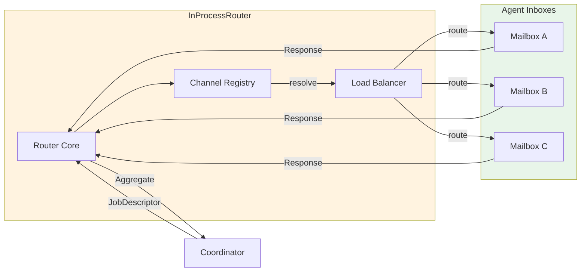

# InProcessRouter

**Type:** technology

### From: mod

The InProcessRouter implements an actor-style message passing infrastructure optimized for intra-process agent communication, providing the transport abstraction that enables the Coordinator to dispatch jobs to registered agents without hardcoding specific invocation mechanisms. As part of the public `router` module alongside the more generic `Router` trait, this implementation leverages in-memory channels (likely Tokio mpsc or broadcast channels) to create mailbox-style inboxes for each agent, embodying the actor model's fundamental principle of location-transparent message passing. The router's design isolates message delivery semantics from agent implementation details, allowing the same agent code to operate unchanged whether messages arrive via in-process channels, HTTP requests, or message queue substrates in future transport implementations.

The InProcessRouter serves as the default transport for the MVP milestone, prioritizing latency minimization and throughput maximization for co-located agents. Its implementation handles the critical concern of backpressure management, ensuring that agents with slower processing rates don't overwhelm system memory through unbounded queue growth. The router integrates with the registry's capability-based discovery to resolve destination addresses, translating logical capability requirements into concrete agent inbox endpoints. This indirection layer enables sophisticated routing patterns including load-balanced distribution across agent pools, failover to secondary agents, and potentially multicast scenarios where single jobs require multiple agent perspectives. The documented `Router` trait alongside `InProcessRouter` indicates intentional abstraction for transport pluggability, anticipating Milestone 5's HttpRouter and RouterComposite extensions that will enable hybrid deployments spanning edge devices, cloud instances, and on-premises infrastructure.

## Diagram

## External Resources

- [Rust message passing concurrency patterns underlying InProcessRouter implementation](https://doc.rust-lang.org/book/ch16-02-message-passing.html) - Rust message passing concurrency patterns underlying InProcessRouter implementation
- [Akka actor model documentation for understanding mailbox and routing patterns](https://doc.akka.io/docs/akka/current/typed/actors.html) - Akka actor model documentation for understanding mailbox and routing patterns
- [Tokio channels tutorial for async message passing implementation details](https://tokio.rs/tokio/tutorial/channels) - Tokio channels tutorial for async message passing implementation details

## Sources

- [mod](../sources/mod.md)

### From: coordinator

The InProcessRouter is the default Router implementation used by the Coordinator when no custom routing strategy is provided. This component handles message delivery within the same process, making it optimal for single-binary deployments where agents and the coordinator coexist in the same address space. The router is instantiated with a configurable request timeout, defaulting to a sensible duration that prevents indefinite blocking on agent responses.

The InProcessRouter implementation is referenced in the Coordinator's `new` and `with_request_timeout` constructors, where it wraps the AgentRegistry to enable direct agent communication. The design allows the Coordinator to remain agnostic to the actual transport mechanism—whether in-process channels, inter-process communication, or network sockets—through the Router trait abstraction. This architectural decision enables seamless scaling from development prototypes to production distributed deployments.

The router's timeout configuration is particularly significant for fault tolerance. By bounding wait times for agent responses, the system can detect and recover from hung or slow agents without cascading failures. The Coordinator's metrics subsystem specifically tracks timeout occurrences separately from general errors, providing operators with visibility into agent health and network latency issues. The InProcessRouter likely leverages Tokio's async channels or similar mechanisms for zero-copy message passing when communicating with co-located agents.
