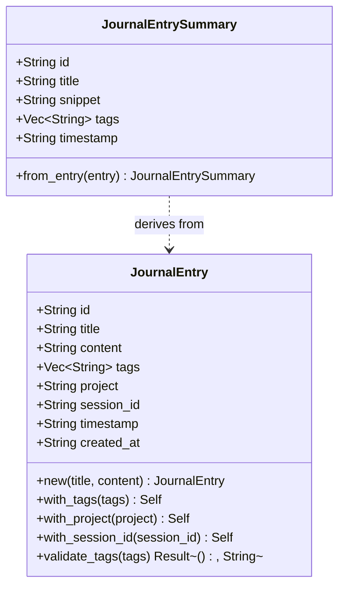

# JournalEntry

**Type:** technology

### From: journal

The `JournalEntry` struct serves as the foundational data structure for the Ragent journaling system, representing a single immutable record of an agent's insight, decision, or discovery. This struct embodies eight carefully designed fields that capture comprehensive metadata about each observation: a UUID v4 identifier for global uniqueness, human-readable title and full content strings, a vector of categorization tags, project and session identifiers for contextual grouping, and dual ISO 8601 timestamps distinguishing between when an event occurred and when it was recorded. The struct derives essential Rust traits including `Debug` for developer inspection, `Clone` for duplication flexibility, and both `Serialize` and `Deserialize` from the serde ecosystem for seamless JSON and other format conversions, making it suitable for API responses and persistent storage alike.

The implementation follows a deliberate architectural philosophy of append-only immutability, where entries are never modified after creation—only deleted or preserved—which establishes a trustworthy audit trail for agent behavior analysis and debugging. This design choice reflects lessons from distributed systems and event sourcing patterns, where immutable logs provide the foundation for reproducible state reconstruction and temporal querying. The `new` constructor generates automatic identifiers and timestamps using the `uuid` crate's V4 random UUIDs and `chrono`'s UTC RFC 3339 formatting, eliminating manual setup overhead while ensuring cryptographic-grade uniqueness and standardized time representation that sorts lexicographically.

Builder-pattern extension methods `with_tags`, `with_project`, and `with_session_id` enable fluent, chainable construction of fully specified entries, each consuming `self` and returning the modified struct marked with `#[must_use]` to prevent accidental discarding of partially constructed objects. These methods employ `impl Into<String>` parameters for API ergonomics, accepting string literals, owned strings, and other convertible types without explicit conversion calls. The companion `validate_tags` static method enforces strict formatting rules on tag strings—non-empty, maximum 64 characters, and restricted to ASCII alphanumeric characters plus hyphens and underscores—preventing malformed data from entering the system and ensuring tag consistency for reliable filtering operations.

## Diagram

## External Resources

- [Serde: A powerful serialization framework for Rust](https://serde.rs/) - Serde: A powerful serialization framework for Rust
- [UUID crate documentation for unique identifier generation](https://docs.rs/uuid/latest/uuid/) - UUID crate documentation for unique identifier generation
- [Chrono: Date and time handling for Rust](https://docs.rs/chrono/latest/chrono/) - Chrono: Date and time handling for Rust
- [Rust Builder Pattern - unofficial patterns guide](https://rust-unofficial.github.io/patterns/patterns/creational/builder.html) - Rust Builder Pattern - unofficial patterns guide

## Sources

- [journal](../sources/journal.md)
