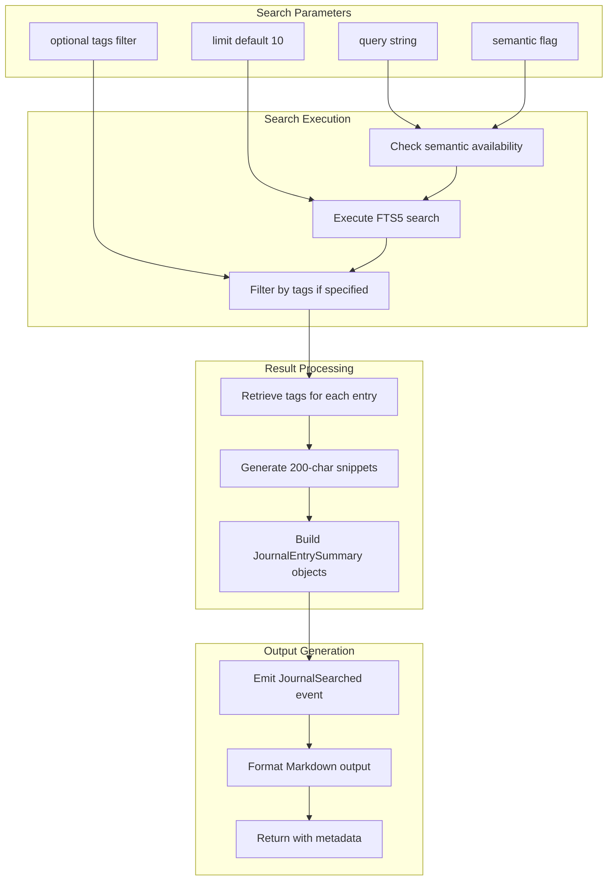

# JournalSearchTool

**Type:** technology

### From: journal

The JournalSearchTool implements hybrid search capabilities across the agent's journal, combining SQLite's FTS5 full-text search with optional semantic similarity search when embeddings are available. This tool represents a sophisticated information retrieval interface that understands both exact keyword matching and conceptual similarity, enabling agents to surface relevant past experiences through multiple query strategies. The search accepts a required query string, optional tag filters requiring all specified tags to be present, a configurable result limit, and a semantic search toggle.

The implementation demonstrates careful attention to search quality and result presentation. The FTS5 integration leverages SQLite's built-in ranking algorithms to surface the most textually relevant entries, while tag filtering applies an intersection constraint ensuring only entries matching all categorical requirements are returned. When semantic search is enabled and an embedding provider is available, the system can theoretically extend beyond lexical matching to find entries with conceptually similar meaning, though the current implementation notes that full semantic enhancement with lazy-embedding is deferred to future iterations.

Result processing includes snippet generation for preview purposes, with content truncated to 200 characters with ellipsis notation for longer entries. Complete tag retrieval from storage enriches each result with full categorical information. The tool emits a JournalSearched event capturing query and result count for analytics, and returns formatted output distinguishing between FTS-only and hybrid search modes. The output formatting uses Markdown for readability, with enumerated results showing titles, timestamps, content snippets, tags, and entry IDs in a structured presentation optimized for agent consumption.

## Diagram

## External Resources

- [SQLite FTS5 full-text search engine documentation](https://www.sqlite.org/fts5.html) - SQLite FTS5 full-text search engine documentation
- [Conceptual overview of semantic search technology](https://en.wikipedia.org/wiki/Semantic_search) - Conceptual overview of semantic search technology
- [OpenAI embeddings guide for semantic similarity applications](https://platform.openai.com/docs/guides/embeddings) - OpenAI embeddings guide for semantic similarity applications

## Sources

- [journal](../sources/journal.md)
