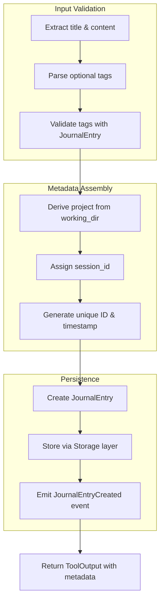

# JournalWriteTool

**Type:** technology

### From: journal

The JournalWriteTool is a core component of the agent's memory persistence layer, designed to capture and store insights, decisions, and discoveries in an append-only journal format. This tool implements the Tool trait and provides structured entry creation with validation, ensuring that all recorded information meets schema requirements before storage. When executed, it extracts the title and content from input parameters, validates optional tags using the JournalEntry validation logic, derives project context from the current working directory, and associates the entry with the active session ID.

The tool's architecture emphasizes data integrity and auditability. Each entry receives a unique identifier and timestamp automatically, preventing duplicate or ambiguous records. The tag validation enforces consistent categorization conventions, rejecting malformed tags that could compromise search effectiveness. Project derivation from the working directory enables automatic organizational scoping without requiring explicit user input, while session association creates traceability for debugging and analytics purposes.

After validation and metadata assembly, the tool persists the entry through the Storage abstraction layer, which handles the actual SQLite operations. Upon successful storage, it emits a JournalEntryCreated event to the event bus, enabling real-time notifications and downstream processing. The tool returns formatted confirmation output including the assigned entry ID and complete metadata, providing immediate feedback to the calling agent about the persistence operation's success.

## Diagram

## External Resources

- [SQLite FTS5 documentation for full-text search capabilities used by the journal system](https://www.sqlite.org/fts5.html) - SQLite FTS5 documentation for full-text search capabilities used by the journal system
- [Anyhow error handling library used for contextual error propagation](https://docs.rs/anyhow/latest/anyhow/) - Anyhow error handling library used for contextual error propagation

## Sources

- [journal](../sources/journal.md)
