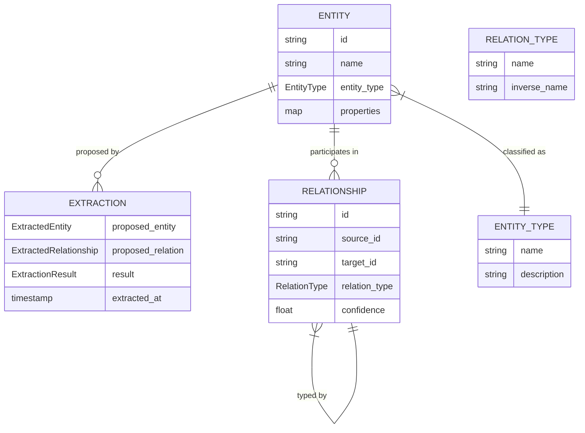

# KnowledgeGraph

**Type:** technology

### From: mod

KnowledgeGraph is ragent's structured knowledge representation system, implementing a graph database abstraction that captures entities, their types, and the relationships between them extracted from agent experiences. This component transforms unstructured narrative memories into queryable semantic networks, enabling relational reasoning that complements the semantic similarity search provided by embeddings. The graph structure uses `Entity` nodes with `EntityType` classification connected by `Relationship` edges with `RelationType` semantics, creating a formal ontology that grows organically through automated extraction and manual curation.

The system distinguishes between runtime representations (`Entity`, `Relationship`) and extraction artifacts (`ExtractedEntity`, `ExtractedRelationship`), maintaining clean separation between canonical graph state and proposed additions requiring validation. Functions like `extract_entities` and `get_knowledge_graph` provide read access for reasoning and visualization, while `store_extraction` handles write operations with appropriate transactional semantics. This design enables incremental graph construction where automated extractions can be reviewed, merged, or rejected before permanent incorporation, preventing pollution of the knowledge base with low-quality inferences.

The KnowledgeGraph integration with `visualisation` module capabilities enables multiple perspectives on accumulated knowledge: graph layouts reveal conceptual clustering and central entities, timelines show temporal evolution of understanding, tag clouds surface frequency patterns, and heatmaps indicate access patterns that inform compaction decisions. This multi-modal introspection supports both operational use by agents seeking contextual information and analytical use by developers understanding agent behavior. The graph structure also facilitates cross-project knowledge transfer, as entity and relationship types can be matched across different codebases to identify relevant prior experience even when project-specific terminology differs.

## Diagram

## External Resources

- [Knowledge graph concepts and history](https://en.wikipedia.org/wiki/Knowledge_graph) - Knowledge graph concepts and history
- [RDF standard for semantic web graphs](https://www.w3.org/RDF/) - RDF standard for semantic web graphs
- [Graph database design patterns](https://neo4j.com/developer/graph-database/) - Graph database design patterns

## Sources

- [mod](../sources/mod.md)
