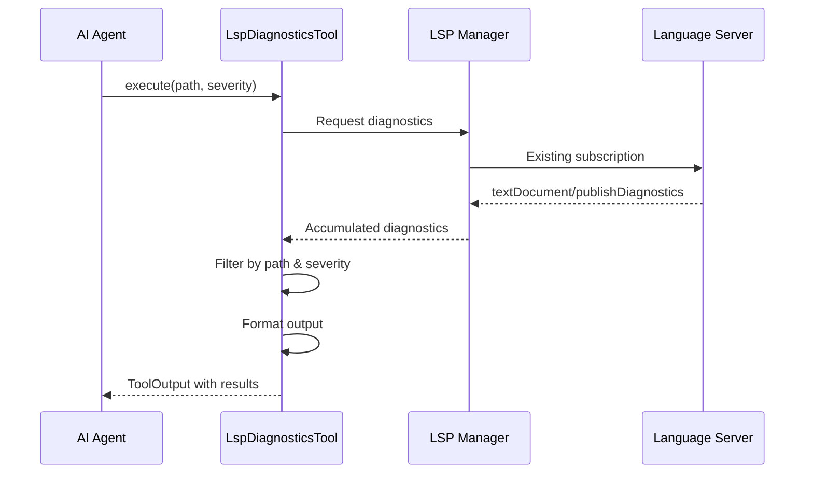

# Language Server Protocol (LSP)

**Type:** technology

### From: lsp_diagnostics

The Language Server Protocol (LSP) is an open, JSON-RPC-based protocol originally developed by Microsoft that standardizes communication between code editors or IDEs and language-specific analysis servers. LspDiagnosticsTool directly leverages this protocol to access diagnostic information, specifically consuming `textDocument/publishDiagnostics` notifications that servers push to clients when they detect issues in source code. This protocol has fundamentally transformed how developer tooling is built and distributed, enabling a single language server implementation to support multiple editors rather than requiring custom plugins for each editor-language combination.

The LSP specification defines a rich set of capabilities beyond diagnostics, including code completion, hover information, go-to-definition, find-references, refactoring, and code formatting. However, the diagnostic functionality remains one of its most essential features, providing real-time feedback about compilation errors, static analysis warnings, style violations, and other code quality issues. The protocol's design uses a client-server architecture where the editor acts as the client initiating requests and receiving notifications, while the language server performs the computationally intensive analysis work. This separation of concerns allows language servers to be implemented in the most appropriate language for the target language's ecosystem, such as Rust for the Rust Language Server or TypeScript for JavaScript/TypeScript support.

LSP was open-sourced by Microsoft in 2016 and has since been adopted by a vast ecosystem of editors and language implementations. Major editors including Visual Studio Code, Neovim, Emacs, Sublime Text, and IntelliJ-based IDEs support LSP, while language servers exist for virtually every mainstream programming language. The protocol's success stems from its pragmatic design that balances completeness with implementability, providing clear specifications for core features while allowing extensions for language-specific capabilities. The diagnostic severity levels defined in LSP—Error, Warning, Information, and Hint—have become a de facto standard for categorizing code issues across the industry.

For AI agent applications like those enabled by ragent-core, LSP represents a critical enabling technology. Rather than building custom parsers and analysis engines for each supported language, agent frameworks can leverage existing, mature language servers that embody years of community knowledge and refinement. This approach dramatically expands the languages and codebases an agent can work with while maintaining high accuracy in understanding code structure and issues. The push-based notification model of LSP diagnostics is particularly well-suited to agent workflows, allowing agents to receive updates as code evolves without polling overhead.

## Diagram

## External Resources

- [Official Language Server Protocol specification and documentation](https://microsoft.github.io/language-server-protocol/) - Official Language Server Protocol specification and documentation
- [LSP textDocument/publishDiagnostics specification](https://microsoft.github.io/language-server-protocol/specifications/specification-current/#textDocument_publishDiagnostics) - LSP textDocument/publishDiagnostics specification
- [Community-maintained list of LSP implementations and language servers](https://langserver.org/) - Community-maintained list of LSP implementations and language servers
- [LSP GitHub repository with specification discussions](https://github.com/microsoft/language-server-protocol) - LSP GitHub repository with specification discussions

## Sources

- [lsp_diagnostics](../sources/lsp-diagnostics.md)

### From: lsp_hover

The Language Server Protocol is an open, JSON-RPC based protocol developed by Microsoft for implementing language-specific features in code editors and IDEs. Standardized as an open specification, LSP enables decoupled architecture where language intelligence providers (servers) communicate with editing clients through a well-defined protocol, eliminating the need for each editor to implement language-specific parsing and analysis for dozens of programming languages. The protocol supports essential development features including code completion, hover information, go-to-definition, find-references, diagnostics, refactoring, and code formatting.

LSP was originally developed for Visual Studio Code and open-sourced in 2016, quickly gaining adoption across the industry. Major language servers now exist for virtually all popular programming languages: rust-analyzer for Rust, gopls for Go, Pyright and Pylance for Python, TypeScript language server, clangd for C/C++, and many others. The protocol has been adopted by editors including Neovim, Emacs, Vim, Sublime Text, Atom, Kate, and Eclipse, fundamentally changing how editor tooling is architected. By separating language logic from editor UI, LSP enables specialists to focus on building excellent language analysis while editors can concentrate on presentation and user experience.

The `textDocument/hover` request, which this tool implements, is one of LSP's core features. When a user hovers over a symbol in their code, the client sends the document URI and position to the server, which responds with rich hover content including type signatures, documentation comments, and deprecation notices. This information is typically rendered as markdown or marked strings with optional language identifiers for syntax highlighting. The protocol uses 0-based line and character positions, requiring careful coordinate transformation when interfacing with systems that use different conventions.

### From: lsp_symbols

The Language Server Protocol is a JSON-RPC based protocol developed by Microsoft that standardizes communication between code editors and language-specific analysis tools. Originally created for Visual Studio Code, LSP has become the industry standard for providing IDE-like features across editors, enabling code completion, go-to-definition, refactoring, and symbol extraction in a language-agnostic way. The protocol separates language intelligence from editor implementation, allowing a single language server to serve multiple editors.

The textDocument/documentSymbol method, which LspSymbolsTool utilizes, returns hierarchical symbol information for a document, including functions, classes, variables, and their relationships. This method is particularly valuable for code navigation and outline views, providing semantic structure that goes beyond simple text search. The protocol's design accommodates both hierarchical responses (showing containment relationships) and flat responses (listing all symbols with locations), requiring clients to handle both variants.

LSP's impact on developer tooling has been transformative, enabling consistent language support across VS Code, Vim, Emacs, and other editors. The protocol specification is actively maintained by Microsoft with contributions from the open source community, and has been adopted by major language ecosystems including Rust (rust-analyzer), Python (pylsp), TypeScript (tsserver), and many others. The standardization has reduced duplication of effort and raised the baseline for language tooling quality across the industry.

### From: lib

The Language Server Protocol is an open, JSON-RPC based protocol developed by Microsoft for implementing language-specific features in editors and IDEs. The ragent-core library includes a dedicated `lsp` module that implements an LSP client, enabling the AI agent to perform code-intelligence queries against language servers. This integration allows ragent to access sophisticated language-specific capabilities including go-to-definition, find-references, hover information, and symbol search across multiple programming languages without requiring language-specific parsing logic within the agent itself. The LSP client architecture represents a critical bridge between the AI agent's reasoning capabilities and precise, context-aware code understanding.

The inclusion of LSP support indicates ragent is designed to operate as a sophisticated development assistant rather than a simple text-generation tool. By leveraging language servers, ragent can obtain accurate semantic information about codebases, enabling more intelligent refactoring suggestions, error detection, and code completion. This approach follows industry best practices established by tools like VS Code, which pioneered the protocol's adoption. The LSP client implementation in Rust suggests careful attention to performance and reliability, as the client must handle concurrent requests, server lifecycle management, and potentially multiple simultaneous language servers for polyglot codebases. The module's placement alongside core functionality indicates that code intelligence is considered a fundamental capability rather than an optional extension.
