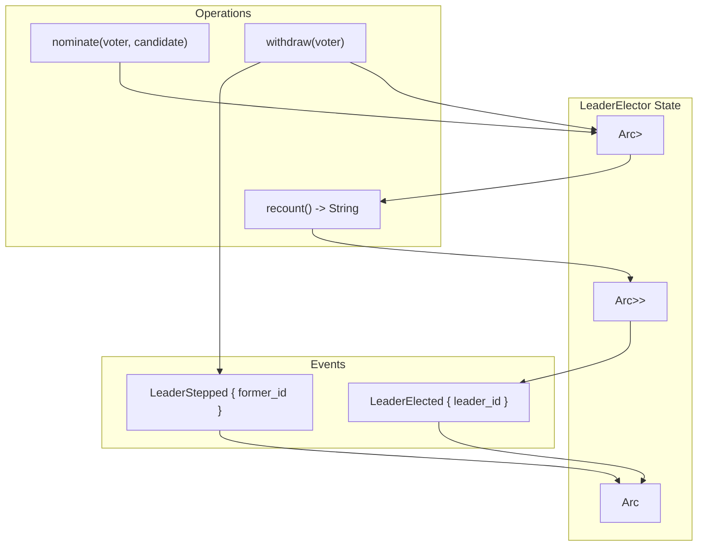

# LeaderElector

**Type:** technology

### From: leader

LeaderElector is a Rust struct that implements an in-process leader election mechanism using a simple majority-vote approach. The struct maintains three core pieces of state: a thread-safe HashMap tracking votes from voter IDs to candidate IDs, an optional string representing the current leader, and a broadcast channel sender for emitting leadership change events. The election algorithm works by tallying votes across all participants, with the candidate receiving the most votes becoming leader. In cases of ties, the system employs deterministic tie-breaking by selecting the candidate with the lexicographically smallest ID, ensuring consistent results across all nodes. This design avoids the complexity of external consensus services while providing sufficient guarantees for single-process deployments or as a building block for more sophisticated distributed systems.

The implementation leverages Tokio's async runtime primitives for safe concurrent access. The votes map and leader field are protected by RwLock, allowing multiple concurrent readers but exclusive writers. The broadcast channel enables any number of subscribers to receive LeaderEvent notifications when leadership changes occur. Key methods include nominate for casting votes, withdraw for removing votes when nodes depart, and recount for tallying votes and determining winners. The recount method is particularly noteworthy for its elegant use of iterator chains to compute the winner in a functional style, demonstrating advanced Rust idioms.

LeaderElector serves as the foundation for the CoordinatorCluster, which delegates actual job execution to the elected leader. The separation of concerns between election logic and cluster management allows the elector to be tested and potentially reused independently. The design assumes a cooperative environment where nodes honestly report their votes; it does not include Byzantine fault tolerance mechanisms. For production deployments requiring stronger guarantees, this implementation would typically be paired with an external consensus service like etcd, Consul, or ZooKeeper, or extended with cryptographic verification of vote authenticity.

## Diagram

## External Resources

- [Tokio broadcast channel documentation for event distribution](https://docs.rs/tokio/latest/tokio/sync/broadcast/index.html) - Tokio broadcast channel documentation for event distribution
- [Rust Arc (atomically reference counted) documentation for shared ownership](https://doc.rust-lang.org/std/sync/struct.Arc.html) - Rust Arc (atomically reference counted) documentation for shared ownership
- [Raft consensus algorithm - commonly used for leader election in distributed systems](https://raft.github.io/) - Raft consensus algorithm - commonly used for leader election in distributed systems

## Sources

- [leader](../sources/leader.md)
