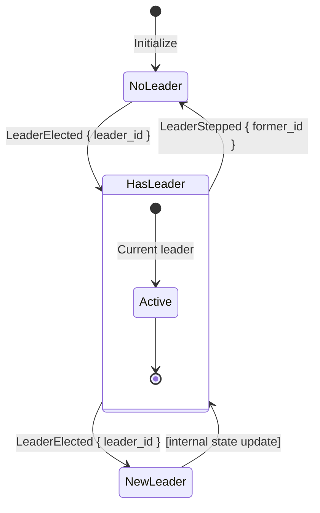

# LeaderEvent

**Type:** technology

### From: leader

LeaderEvent is a Rust enum that defines the notification protocol for leadership changes within the election system. The enum has two variants: LeaderElected, which signals that a new leader has been chosen and includes the leader's ID, and LeaderStepped, which indicates that a leader has voluntarily or involuntarily relinquished leadership and includes the former leader's ID. This simple event model enables loose coupling between the election mechanism and cluster management logic, allowing components to react to leadership changes without direct method invocation. The enum derives Debug and Clone, making it suitable for logging, testing, and distribution across multiple async tasks.

The event system is implemented using Tokio's broadcast channels, which provide a multi-producer multi-consumer pattern where each subscriber receives all messages sent after their subscription. The LeaderElector maintains a broadcast::Sender<LeaderEvent> that distributes events to all registered receivers. This design supports multiple concurrent observers, such as monitoring systems, logging infrastructure, or reactive components that need to reconfigure themselves when leadership changes. The events are sent in the recount method when leadership actually changes, and in the withdraw method when the current leader steps down without an immediate replacement.

LeaderEvent demonstrates the importance of explicit state change notifications in distributed systems. Rather than requiring components to poll for leadership status, the push-based event model reduces latency and resource consumption. The enum's structure follows Rust best practices for event design: using struct variants with named fields for clarity, keeping payload data minimal but sufficient for identification, and avoiding nested complexity that would complicate pattern matching. In production systems, this event stream might be bridged to external monitoring tools like Prometheus, distributed tracing systems, or cluster orchestration platforms that need to track leadership history for debugging and auditing purposes. The simplicity of this two-variant design could be extended with additional events for more complex scenarios, such as split-brain detection or quorum loss notifications.

## Diagram

## External Resources

- [Rust enums and pattern matching documentation](https://doc.rust-lang.org/book/ch06-01-defining-an-enum.html) - Rust enums and pattern matching documentation
- [Tokio broadcast sender for event distribution](https://docs.rs/tokio/latest/tokio/sync/broadcast/struct.Sender.html) - Tokio broadcast sender for event distribution

## Sources

- [leader](../sources/leader.md)
