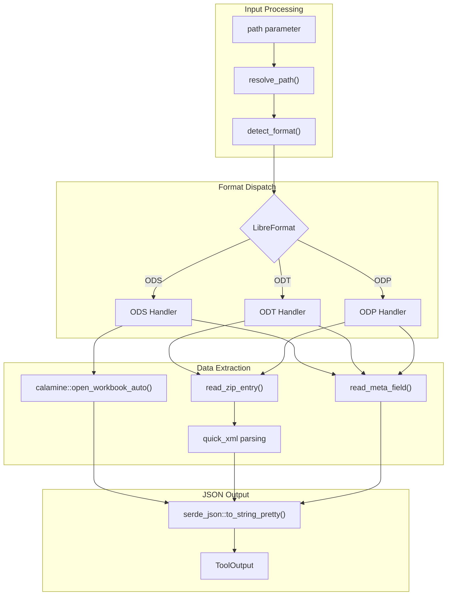

# LibreInfoTool

**Type:** product

### From: libreoffice_info

LibreInfoTool is a specialized Rust struct that implements the `Tool` trait, designed to extract metadata and structural information from OpenDocument Format files without requiring full content reads. The tool serves as part of a larger agent-based system where tools are composable units that can be discovered and executed dynamically. Its primary value proposition lies in its efficiency—by parsing only the necessary XML structures within ODF ZIP archives, it provides rapid insights into document characteristics that would be useful for content management, document indexing, or automated workflow systems.

The tool's implementation demonstrates sophisticated software engineering practices, including the use of Rust's type system for safety, async/await patterns for performance, and careful error handling with the `anyhow` crate. It processes three distinct ODF variants through specialized private functions: `info_ods` for spreadsheets, `info_odt` for text documents, and `info_odp` for presentations. Each variant requires different parsing strategies, showcasing the tool's adaptability to varying internal document structures while maintaining a unified external interface.

LibreInfoTool operates within a permission-based security model, declaring itself as requiring "file:read" permissions. This design indicates integration with a larger system that implements capability-based security, where tools must explicitly declare their resource access requirements. The tool's JSON-based parameter schema and output format further suggest its role in an API-driven or LLM-agent context, where structured data exchange is essential for interoperability with other system components.

## Diagram

## External Resources

- [calamine - Excel and ODS reader for Rust](https://crates.io/crates/calamine) - calamine - Excel and ODS reader for Rust
- [quick-xml - High-performance XML reader/writer](https://crates.io/crates/quick-xml) - quick-xml - High-performance XML reader/writer
- [OASIS OpenDocument Format specification](https://docs.oasis-open.org/office/OpenDocument/v1.3/os/part3-cd04/OpenDocument-v1.3-os-part3-cd04.html) - OASIS OpenDocument Format specification

## Sources

- [libreoffice_info](../sources/libreoffice-info.md)
