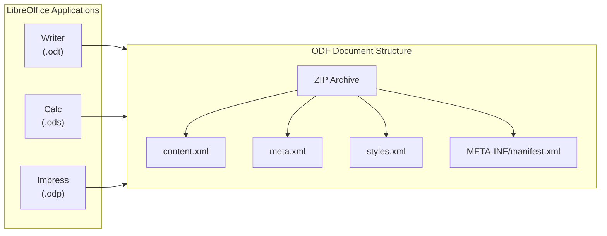

# LibreOffice

**Type:** technology

### From: libreoffice_common

LibreOffice is a free and open-source office suite, developed by The Document Foundation. It was forked from OpenOffice.org in 2010 and has become one of the most widely used open-source office productivity suites worldwide. The suite includes applications for word processing (Writer), spreadsheets (Calc), presentations (Impress), vector graphics (Draw), databases (Base), and formula editing (Math). LibreOffice uses the OpenDocument Format (ODF) as its native file format, an open standard maintained by OASIS and ISO/IEC 26300.

The significance of LibreOffice extends beyond its functionality as desktop software. Its document formats, particularly ODT (text documents), ODS (spreadsheets), and ODP (presentations), have become standard interchange formats in government and enterprise environments seeking vendor-neutral document formats. The European Union, many national governments, and numerous organizations have adopted ODF as a preferred or mandatory format for document exchange to ensure long-term accessibility and avoid vendor lock-in. This political and technical significance makes robust ODF processing capabilities essential for document automation systems.

From a technical perspective, LibreOffice's implementation of ODF is the reference implementation against which other tools are often measured. The ODF specification is complex, covering not just document content but also metadata, styles, settings, and manifest information. Understanding LibreOffice's behavior with ODF files is crucial for developers building interoperable document processing systems. The code in this module assumes UTF-8 encoding for ODF files, which aligns with the ODF specification's requirements and LibreOffice's default behavior.

## Diagram

## External Resources

- [Official LibreOffice website and download](https://www.libreoffice.org/) - Official LibreOffice website and download
- [Wikipedia article on LibreOffice history and features](https://en.wikipedia.org/wiki/LibreOffice) - Wikipedia article on LibreOffice history and features
- [The Document Foundation, steward of LibreOffice](https://www.documentfoundation.org/) - The Document Foundation, steward of LibreOffice

## Sources

- [libreoffice_common](../sources/libreoffice-common.md)
