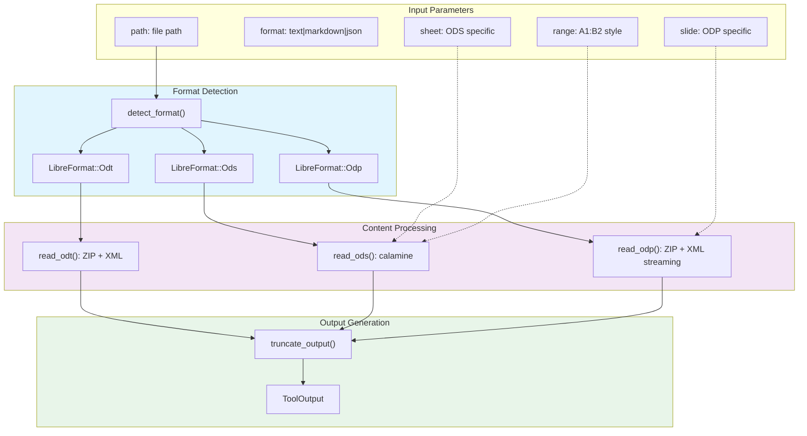

# LibreReadTool

**Type:** product

### From: libreoffice_read

LibreReadTool is a specialized document reading component designed for integration into agent-based systems, providing programmatic access to OpenDocument Format files without requiring a running LibreOffice instance. The tool implements the `Tool` trait, enabling it to participate in structured agent workflows where it can be invoked with JSON parameters and return standardized output. Its architecture is built around format-specific parsing strategies that optimize for accuracy and performance: ODS files leverage the `calamine` crate's native OpenDocument Spreadsheet support, which provides full formula evaluation and data type preservation, while ODT and ODP files use a lightweight approach extracting `content.xml` from the ZIP archive and parsing with `quick-xml`. This dual-strategy approach reflects practical engineering tradeoffs—spreadsheets require precise cell addressing and data structure preservation, while text documents and presentations prioritize robust text extraction over formatting fidelity. The tool supports three output formats (text, markdown, json) and includes intelligent features like automatic sheet detection, A1:B2 range parsing for spreadsheets, and slide-by-slide extraction for presentations. Its permission category of "file:read" indicates it's designed for security-conscious environments where file system access is gated. The implementation demonstrates production-ready patterns including async/await integration, blocking task offloading for file I/O, comprehensive error context propagation, and output size limits to prevent memory exhaustion.

## Diagram

## External Resources

- [Calamine crate - Rust library for reading Excel and ODS files](https://crates.io/crates/calamine) - Calamine crate - Rust library for reading Excel and ODS files
- [Quick-xml crate - High-performance XML reader/writer for Rust](https://crates.io/crates/quick-xml) - Quick-xml crate - High-performance XML reader/writer for Rust
- [OASIS OpenDocument Format specification](https://docs.oasis-open.org/office/OpenDocument/v1.3/os/part4-formula/OpenDocument-v1.3-os-part4-formula.html) - OASIS OpenDocument Format specification

## Sources

- [libreoffice_read](../sources/libreoffice-read.md)
