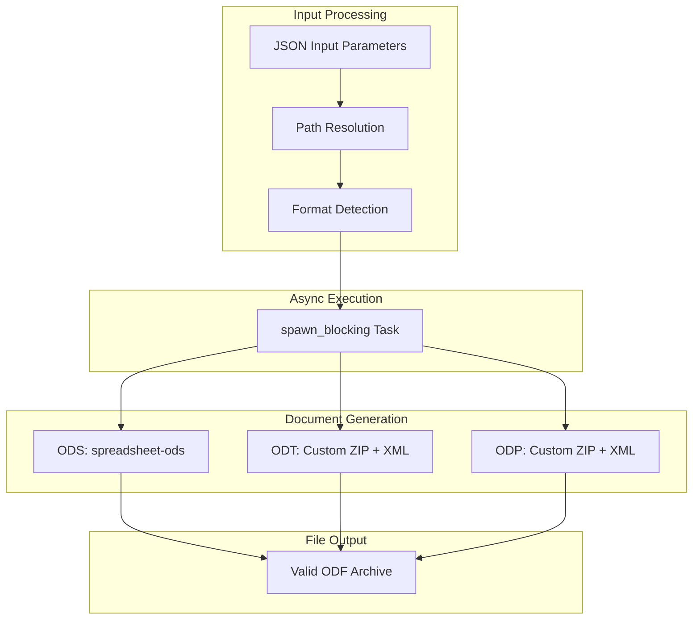

# LibreWriteTool

**Type:** product

### From: libreoffice_write

LibreWriteTool is a Rust struct that serves as the primary interface for creating and overwriting OpenDocument files within the ragent-core toolkit. This tool implements the `Tool` trait, making it compatible with the broader agent framework's architecture for asynchronous, permission-aware operations. The struct itself is a zero-sized type (unit struct), with all functionality implemented through trait methods. Its design philosophy centers on providing a unified API across three distinct document formats—ODT for word processing, ODS for spreadsheets, and ODP for presentations—while internally employing format-specific generation strategies. For ODS files, it leverages the mature `spreadsheet-ods` crate, which handles the complexities of spreadsheet cell addressing, workbook management, and formula support. For ODT and ODP, which lack equivalent high-level Rust libraries, the tool implements custom ZIP archive construction with hand-crafted XML output that conforms to the ODF specification. The tool's parameter schema is carefully designed to accommodate flexible content input, supporting both simple string-based content for quick document creation and richly structured JSON arrays for documents requiring precise formatting control. This flexibility makes LibreWriteTool particularly valuable in LLM-powered agent systems where the model may generate content in various formats.

## Diagram

## External Resources

- [spreadsheet-ods crate documentation for ODS generation](https://docs.rs/spreadsheet-ods/latest/spreadsheet_ods/) - spreadsheet-ods crate documentation for ODS generation
- [zip crate documentation for ZIP archive creation](https://docs.rs/zip/latest/zip/) - zip crate documentation for ZIP archive creation

## Sources

- [libreoffice_write](../sources/libreoffice-write.md)
