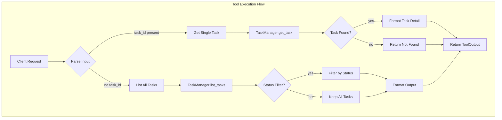

# ListTasksTool

**Type:** technology

### From: list_tasks

ListTasksTool is a core infrastructure component in the ragent-core crate that provides introspection and monitoring capabilities for sub-agent task execution in multi-agent AI systems. This struct implements the Tool trait to expose a standardized interface for querying task status information, demonstrating the architectural pattern of encapsulating system observability behind well-defined tool contracts. The implementation reveals sophisticated software design choices, including support for both list-based and detail-oriented query modes, optional status filtering, and comprehensive metadata extraction. The tool's parameter schema generation using serde_json enables dynamic JSON schema construction for runtime validation, while its permission categorization under "agent:spawn" indicates integration with a unified security model for agent lifecycle operations.

The technical implementation of ListTasksTool showcases production-grade Rust patterns including the use of async-trait for asynchronous trait methods, careful error propagation through anyhow::Result, and ergonomic option handling with combinators like and_then and ok_or_else. The tool interacts with a TaskManager abstraction that persists task state across asynchronous operations, enabling reliable tracking of long-running background agent processes. Output formatting demonstrates attention to user experience through Markdown table generation with emoji status indicators, while simultaneously maintaining machine-readable JSON metadata for programmatic integration. The duration calculation logic using chrono::Utc reveals precise temporal tracking requirements, and the session-scoped task queries reflect architectural decisions around multi-tenancy and isolation in agent execution environments.

ListTasksTool serves as a critical debugging and monitoring interface in the broader agent ecosystem, enabling developers and autonomous agents themselves to inspect the state of delegated operations. The hierarchical session relationships tracked by the tool (parent_session_id and child_session_id) support complex patterns of recursive agent delegation where agents spawn sub-agents that may themselves spawn additional agents. The distinction between background and foreground tasks, along with the comprehensive result and error capture, provides the foundation for robust error recovery and progress monitoring in distributed agent computations. The tool's design as a reusable component implementing a generic Tool trait suggests an extensible architecture where additional monitoring capabilities can be composed through similar implementations.

## Diagram

## External Resources

- [async-trait crate documentation for ergonomic async trait implementation in Rust](https://docs.rs/async-trait/latest/async_trait/) - async-trait crate documentation for ergonomic async trait implementation in Rust
- [anyhow crate documentation for flexible error handling in Rust applications](https://docs.rs/anyhow/latest/anyhow/) - anyhow crate documentation for flexible error handling in Rust applications
- [chrono crate documentation for date and time handling in Rust](https://docs.rs/chrono/latest/chrono/) - chrono crate documentation for date and time handling in Rust
- [Serde serialization framework documentation for Rust](https://serde.rs/) - Serde serialization framework documentation for Rust

## Sources

- [list_tasks](../sources/list-tasks.md)
