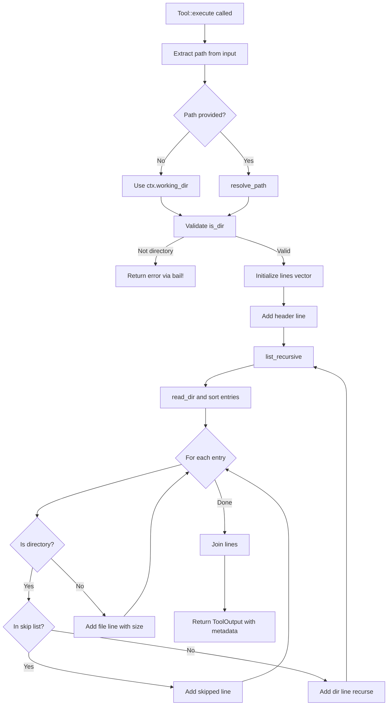

# ListTool

**Type:** technology

### From: list

ListTool is the central struct exported by the `list.rs` module, representing a file system tool designed for agent-based systems that require directory introspection capabilities. This struct implements the `Tool` trait, making it a first-class component within what appears to be a larger agent execution framework where tools are dynamically invoked based on intent recognition and parameter schemas. The struct itself is a zero-sized type (unit struct), carrying no runtime state, which reflects a functional design where all behavior is determined by implementation rather than instance data. This pattern is common in Rust systems where tool definitions are static and thread-safe, allowing for efficient registration and dispatch without allocation overhead. The design choice of using a unit struct also suggests that the tool is intended to be instantiated cheaply and potentially reused across multiple execution contexts.

The implementation of `ListTool` demonstrates sophisticated integration with modern Rust ecosystem patterns. It uses `#[async_trait::async_trait]` to enable asynchronous execution, which is essential for I/O-bound filesystem operations that should not block the executor. The tool defines a JSON schema for its parameters through the `parameters_schema` method, enabling runtime validation and automatic user interface generation in agent systems. This schema accepts two optional parameters: `path` for specifying the target directory and `depth` for controlling recursion limits. The permission category of `"file:read"` indicates that this tool is classified within a security model that restricts potentially dangerous operations, allowing administrators to grant or deny read access independently of other capabilities.

The execution flow of `ListTool` reveals careful attention to error handling and user experience. When `execute` is called, it first resolves the target path using a helper function that handles both absolute and relative path specifications, defaulting to the working directory from the tool context. It validates that the resolved path is actually a directory before proceeding, producing clear error messages using `anyhow::bail!` when preconditions fail. The recursion depth defaults to 2 levels, balancing comprehensiveness with output brevity for typical use cases. The tool produces output that serves dual purposes: a formatted tree string for immediate human readability, and JSON metadata containing entry counts and the resolved path for programmatic consumption. This dual-output design reflects the tool's positioning within an agent system where both human operators and downstream automation may need to interpret results.

The internal `list_recursive` function embodies substantial filesystem domain expertise. It implements a classic tree traversal algorithm with several production-quality refinements. Entries are sorted with directories appearing before files, and within each category, alphabetical ordering is applied—this creates a predictable, scanable output format. The function filters hidden entries (those starting with `.`) and specifically recognizes and skips directories that commonly contain generated or vendored content that would overwhelm output. The tree formatting uses Unicode box-drawing characters (`├──`, `└──`, `│`) to create visual hierarchy, with careful prefix construction to maintain alignment across recursion levels. File sizes are computed from metadata and formatted using human-readable units (bytes, KB, MB), with the `format_size` helper providing appropriate precision for each scale. These details collectively demonstrate that ListTool is not merely a proof-of-concept but a refined tool intended for daily use in development and operational workflows.

## Diagram

## External Resources

- [anyhow crate documentation for flexible error handling in Rust applications](https://docs.rs/anyhow/latest/anyhow/) - anyhow crate documentation for flexible error handling in Rust applications
- [async-trait crate enabling async methods in traits](https://docs.rs/async-trait/latest/async_trait/) - async-trait crate enabling async methods in traits
- [serde_json crate for JSON serialization and Value types](https://docs.rs/serde_json/latest/serde_json/) - serde_json crate for JSON serialization and Value types
- [Rust standard library PathBuf documentation for cross-platform path handling](https://doc.rust-lang.org/std/path/struct.PathBuf.html) - Rust standard library PathBuf documentation for cross-platform path handling

## Sources

- [list](../sources/list.md)
