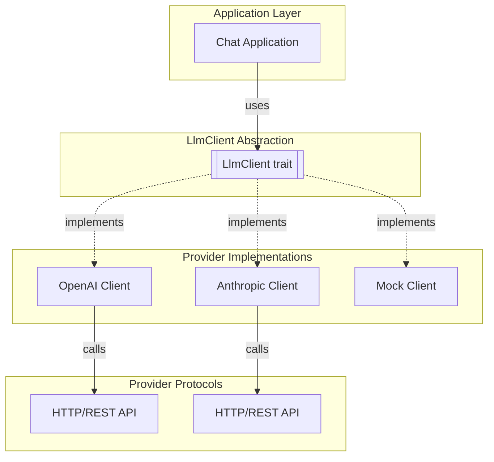

# LlmClient

**Type:** technology

### From: mod

The `LlmClient` trait serves as the foundational abstraction for all LLM provider integrations in the ragent-core crate. This trait defines a single asynchronous method, `chat`, which accepts a `ChatRequest` and returns a pinned boxed stream of `StreamEvent` values. The design leverages Rust's async ecosystem through the `async-trait` crate, enabling elegant async trait definitions that would otherwise require complex workarounds due to Rust's lifetime rules. Implementors of this trait—such as backends for OpenAI's GPT models, Anthropic's Claude family, or other compatible services—are responsible for the provider-specific HTTP request construction, authentication, response parsing, and event stream normalization.

The trait's method signature reveals important architectural decisions. The return type `anyhow::Result<Pin<Box<dyn futures::Stream<Item = StreamEvent> + Send>>>` uses `anyhow` for flexible error handling, `Pin<Box<...>>` for heap-allocated self-referential streams, and explicit `Send` bounds for cross-thread safety. This design accommodates streaming responses where tokens arrive incrementally, allowing applications to display partial results immediately rather than waiting for complete responses. The streaming approach is essential for interactive applications, as it reduces perceived latency and enables real-time tool execution workflows.

The `LlmClient` abstraction enables significant code reuse and testing benefits. Application code can depend on `Box<dyn LlmClient>` or generic `<T: LlmClient>` parameters, writing provider-agnostic logic that seamlessly switches between different models or services. This pattern supports mocking for unit tests, load balancing across providers, and fallback strategies when rate limits are encountered. The trait's `Send + Sync` supertrait bounds ensure that client implementations can safely be shared across async tasks and threads, critical for high-throughput server applications.

## Diagram

## External Resources

- [async-trait crate documentation for async trait support in Rust](https://docs.rs/async-trait/latest/async_trait/) - async-trait crate documentation for async trait support in Rust
- [anyhow crate for flexible error handling in Rust](https://docs.rs/anyhow/latest/anyhow/) - anyhow crate for flexible error handling in Rust
- [Asynchronous Programming in Rust official book](https://rust-lang.github.io/async-book/) - Asynchronous Programming in Rust official book

## Sources

- [mod](../sources/mod.md)
