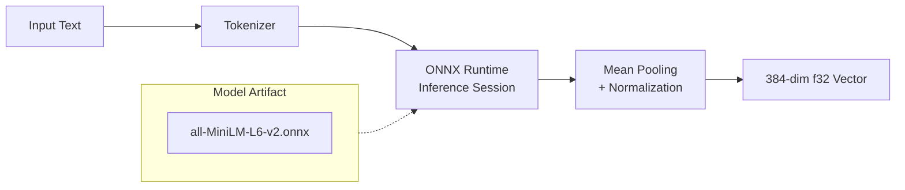

# LocalEmbeddingProvider

**Type:** technology

### From: embedding

LocalEmbeddingProvider is the production-grade embedding implementation that leverages ONNX Runtime to execute transformer-based sentence embedding models locally on the user's hardware. This provider enables genuine semantic search capabilities by converting text into dense vector representations that capture semantic meaning beyond superficial keyword matching. The implementation is conditionally compiled behind the `embeddings` feature flag, ensuring that ONNX Runtime dependencies and model files are only included when explicitly requested. By default, the provider uses the `all-MiniLM-L6-v2` sentence-transformer model, which produces 384-dimensional embeddings and represents a well-established balance between computational efficiency and representational quality.

The provider's architecture integrates with the ONNX Runtime ecosystem, a cross-platform inference engine optimized for running machine learning models with minimal dependencies. Unlike cloud-based embedding APIs, LocalEmbeddingProvider performs all computation on-device, ensuring data privacy and eliminating network latency. This design choice is particularly significant for applications handling sensitive information or requiring offline operation. The batch embedding method is optimized for throughput, allowing multiple texts to be processed in a single model invocation, which substantially outperforms sequential processing when GPU acceleration is available.

LocalEmbeddingProvider extends the capabilities of the ragent system from syntactic keyword matching to genuine semantic understanding. When integrated with the memory subsystem, it enables retrieval of relevant information based on conceptual similarity rather than lexical overlap. For example, a query about "capital of France" can match entries mentioning "Paris" even without explicit keyword overlap. The 384-dimensional output vectors are compatible with SQLite's native storage and the module's cosine similarity utilities, creating a complete local-first semantic search pipeline. The provider maintains thread safety through Send + Sync bounds, allowing shared access across async tasks typically coordinated through Arc pointers.

## Diagram

## External Resources

- [all-MiniLM-L6-v2 model on Hugging Face - the default sentence transformer](https://huggingface.co/sentence-transformers/all-MiniLM-L6-v2) - all-MiniLM-L6-v2 model on Hugging Face - the default sentence transformer
- [ONNX Runtime official documentation](https://onnxruntime.ai/) - ONNX Runtime official documentation
- [Sentence Transformers documentation and model zoo](https://www.sbert.net/) - Sentence Transformers documentation and model zoo

## Sources

- [embedding](../sources/embedding.md)
