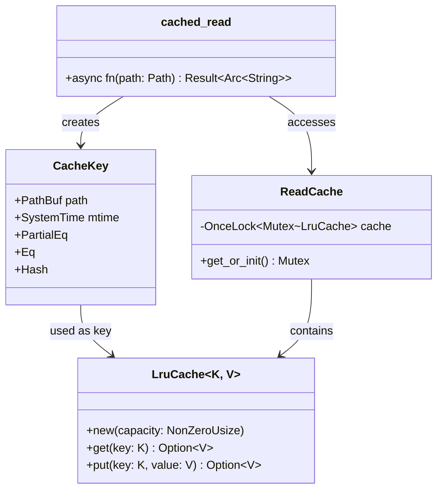

# LRU Cache Implementation

**Type:** technology

### From: read

The LRU (Least Recently Used) cache implementation in read.rs represents a carefully engineered solution to the problem of redundant file I/O in agent-based systems. The cache is built using a combination of Rust's synchronization primitives and the lru crate, specifically utilizing `OnceLock` for lazy static initialization, `Mutex` for thread-safe access, and `Arc<String>` for efficient shared ownership of cached file contents. This architecture allows multiple concurrent tasks to read the same cached file without data races or unnecessary memory duplication. The cache key design is particularly noteworthy: by combining the absolute file path with the file's last-modified timestamp (`SystemTime`), the implementation achieves cache coherence without requiring expensive file content hashing or periodic cache invalidation scans.

The cache capacity is fixed at 256 entries, a balance between memory utilization and hit rate optimization for typical agent workflows. When the cache reaches capacity, the least recently accessed entry is evicted automatically by the underlying lru crate implementation. The use of `NonZeroUsize` for cache sizing ensures compile-time guarantees that the cache will always have a valid capacity, eliminating a class of potential runtime errors. The locking strategy employed minimizes contention by holding the mutex only for brief cache lookup and update operations, never across await points where the async executor might need to yield control. This careful attention to lock granularity prevents the cache from becoming a bottleneck in high-concurrency scenarios.

The `Arc<String>` return type from cached_read enables zero-copy sharing of file contents throughout the application. When a cache hit occurs, the function returns a cloned `Arc` pointing to the existing string data, which increments an atomic reference count rather than copying the potentially large file contents. This optimization is crucial for performance when agents work with large configuration files or source code repositories where the same files may be accessed dozens of times per session. The cache's integration with Tokio's async runtime ensures that file metadata retrieval and content reading operations are non-blocking, allowing other agent tasks to proceed while waiting for disk I/O to complete.

## Diagram

## External Resources

- [LRU cache crate on crates.io](https://crates.io/crates/lru) - LRU cache crate on crates.io
- [Rust OnceLock documentation for lazy initialization](https://doc.rust-lang.org/std/sync/struct.OnceLock.html) - Rust OnceLock documentation for lazy initialization
- [Rust Arc (atomic reference counting) documentation](https://doc.rust-lang.org/std/sync/struct.Arc.html) - Rust Arc (atomic reference counting) documentation

## Sources

- [read](../sources/read.md)
