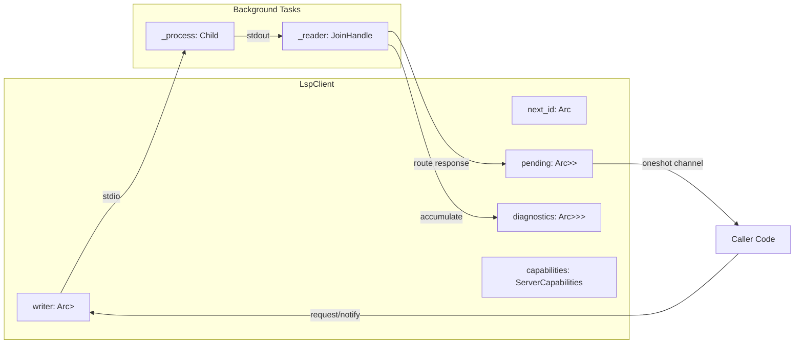

# LspClient

**Type:** product

### From: client

The `LspClient` struct represents the core abstraction for managing an active JSON-RPC connection to a single Language Server Protocol (LSP) server process. It encapsulates all the necessary state and communication channels required to interact with an LSP server, including the buffered writer for sending messages, atomic ID generation for request correlation, pending request tracking through oneshot channels, and accumulated diagnostics storage. The struct is designed with Rust's ownership and concurrency model in mind, using `Arc` (atomic reference counting) wrappers around synchronization primitives to enable safe sharing across async tasks.

The implementation demonstrates sophisticated process management by keeping the `Child` process handle and reader task handle as private fields (`_process` and `_reader`) that are never directly accessed but whose existence ensures proper resource cleanup. When the `LspClient` is dropped, these fields are dropped in turn, triggering the `kill_on_drop(true)` behavior configured during process spawning. This pattern, often called "keep-alive ownership," prevents premature termination of the server process while the client is in use. The `ServerCapabilities` field stores the server's reported capabilities from initialization, enabling capability-based feature detection for conditional client behavior.

The client provides a high-level, typed interface over the underlying JSON-RPC protocol. Methods like `request` and `notify` abstract away the details of message serialization, ID generation, and response routing, while document-specific operations like `open_document` and `close_document` handle the conversion between filesystem paths and LSP URIs. The timeout configuration from `LspServerConfig` is applied consistently across operations, preventing indefinite waits for unresponsive servers. This design balances protocol completeness with ergonomic Rust APIs, making it suitable for integration into larger code analysis or IDE tooling systems.

## Diagram

## External Resources

- [Official Language Server Protocol specification](https://microsoft.github.io/language-server-protocol/) - Official Language Server Protocol specification
- [Tokio async runtime documentation](https://tokio.rs/) - Tokio async runtime documentation
- [Rust lsp-types crate documentation](https://docs.rs/lsp-types/latest/lsp_types/) - Rust lsp-types crate documentation

## Sources

- [client](../sources/client.md)
