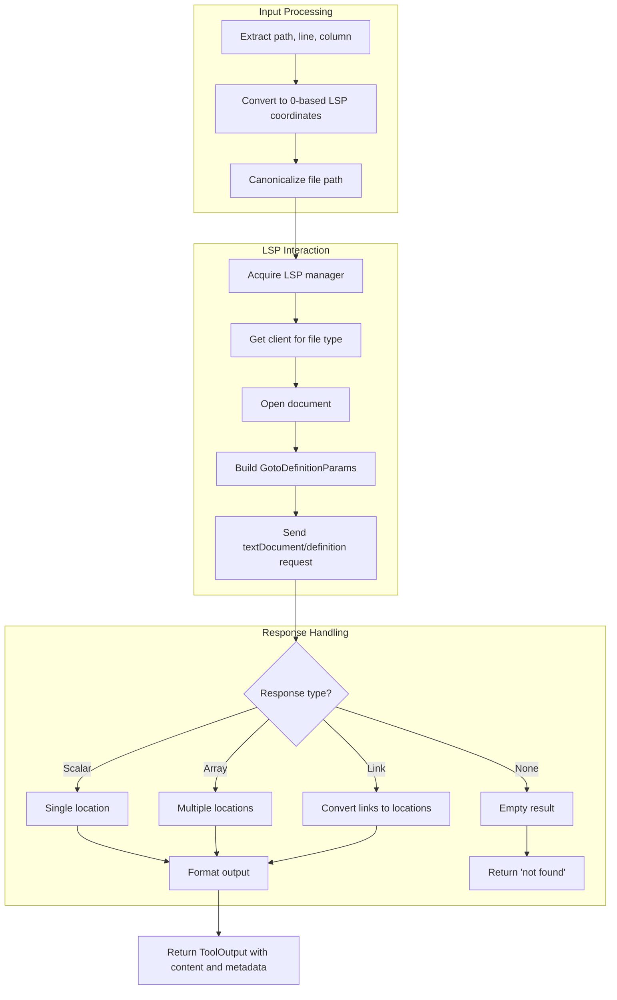

# LspDefinitionTool

**Type:** technology

### From: lsp_definition

LspDefinitionTool is a Rust struct that implements the Tool trait to provide go-to-definition functionality for an intelligent agent system. This tool serves as a bridge between agent commands and Language Server Protocol servers, enabling automatic code navigation and symbol resolution. The tool's primary purpose is to locate where symbols are defined in source code, returning file paths and precise line numbers for discovered definitions.

The implementation demonstrates sophisticated integration with the broader LSP ecosystem. It requires an LSP manager to be configured in the agent's context, which maintains connections to language-specific servers. When executed, the tool performs coordinate translation from 1-based line and column numbers (user-friendly) to 0-based indices (LSP protocol standard), canonicalizes file paths for consistent handling, and manages document lifecycle through opening and tracking. The tool handles multiple response formats from LSP servers: single scalar locations, arrays of locations for overloaded symbols, and location links, ensuring broad compatibility with different language server implementations.

The tool's permission category of "lsp:read" classifies it as a non-destructive read operation, appropriate for safe execution in agent workflows. Error handling is comprehensive, covering missing parameters, unresolvable paths, unavailable LSP servers, document opening failures, and request execution errors. Results are formatted in both human-readable text and structured JSON metadata, supporting both direct user presentation and downstream programmatic processing.

## Diagram

## External Resources

- [Official Language Server Protocol specification](https://microsoft.github.io/language-server-protocol/) - Official Language Server Protocol specification
- [lsp-types crate documentation for Rust LSP types](https://docs.rs/lsp-types/latest/lsp_types/) - lsp-types crate documentation for Rust LSP types
- [async-trait crate for async trait implementations](https://crates.io/crates/async-trait) - async-trait crate for async trait implementations

## Sources

- [lsp_definition](../sources/lsp-definition.md)
