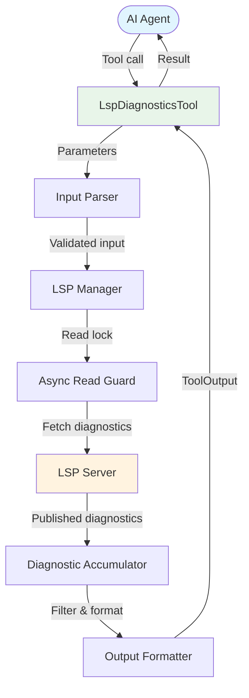

# LspDiagnosticsTool

**Type:** technology

### From: lsp_diagnostics

LspDiagnosticsTool is a core component of the ragent-core framework that enables AI agents to programmatically access and analyze compiler diagnostics from Language Server Protocol (LSP) servers. This tool serves as a critical bridge between traditional IDE functionality and automated agent-based workflows, allowing AI systems to understand code quality issues, compilation errors, and semantic warnings without requiring a graphical interface. The tool is designed to work with any LSP-compliant language server, making it language-agnostic and extensible across the entire ecosystem of programming languages that support LSP, including Rust, TypeScript, Python, Go, and many others.

The implementation of LspDiagnosticsTool reflects a mature understanding of both the LSP specification and practical requirements for automated code analysis. By consuming `textDocument/publishDiagnostics` notifications that LSP servers push upon file analysis, the tool provides real-time access to diagnostic information that accumulates during an editing session. This push-based model is essential for efficiency, as it avoids the need for polling or repeated file analysis. The tool's architecture separates concerns cleanly: parameter validation, LSP manager interaction, diagnostic filtering, and output formatting are handled in distinct phases within the `execute` method, promoting maintainability and testability.

Historically, tools like LspDiagnosticsTool emerged from the broader movement toward Language Server Protocol adoption, which began with Microsoft's development of the protocol in 2016. Prior to LSP, each editor required custom language support plugins, creating fragmentation and duplicated effort. LSP standardized the communication between editors and language analyzers, enabling tools like this one to emerge as platform-agnostic solutions. The ragent-core framework specifically targets AI agent use cases, representing a newer paradigm where language models and automated agents interact with development tools directly rather than through human-oriented interfaces.

The significance of LspDiagnosticsTool extends beyond simple error reporting. By providing structured JSON output alongside human-readable text, it enables downstream AI systems to programmatically reason about code quality, suggest fixes, prioritize refactoring efforts, and make informed decisions about code changes. The severity filtering capability allows agents to focus on critical errors during initial analysis and progressively consider warnings and hints as code quality improves. This graduated approach mirrors human developer workflows and supports iterative improvement processes in automated coding assistants.

## Diagram

## External Resources

- [Official Language Server Protocol specification by Microsoft](https://microsoft.github.io/language-server-protocol/) - Official Language Server Protocol specification by Microsoft
- [Rust lsp-types crate documentation for LSP type definitions](https://docs.rs/lsp-types/latest/lsp_types/) - Rust lsp-types crate documentation for LSP type definitions
- [Rust Language Server - reference LSP implementation for Rust](https://github.com/rust-lang/rls) - Rust Language Server - reference LSP implementation for Rust

## Sources

- [lsp_diagnostics](../sources/lsp-diagnostics.md)
