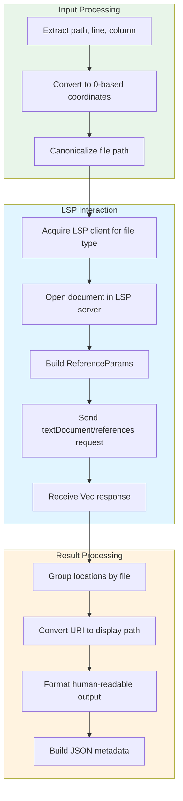

# LspReferencesTool

**Type:** product

### From: lsp_references

LspReferencesTool is a specialized agent tool designed to perform cross-workspace symbol reference analysis through the Language Server Protocol. Implemented as a Rust struct with no fields, it follows the zero-sized type pattern common in Rust's trait-based plugin systems, where the type itself carries all necessary behavior while remaining extremely lightweight to construct and move. The tool serves a critical function in code intelligence workflows: when an agent needs to understand how a particular function, variable, or type is used throughout a codebase, this tool provides accurate, language-aware results without requiring the agent to implement language-specific parsing logic.

The tool's design reflects deep integration with the larger ragent-core ecosystem, as evidenced by its use of shared `ToolContext` containing an `lsp_manager` for client acquisition. This manager-based approach allows multiple tools to share LSP server connections, avoiding the overhead of spawning separate language servers for each operation. The tool implements the `Tool` trait through `async_trait`, enabling non-blocking execution that doesn't freeze the agent while waiting for potentially slow LSP server responses—a crucial characteristic when analyzing large codebases where reference queries might take hundreds of milliseconds or longer.

Implementation highlights include comprehensive parameter validation with descriptive error messages, sophisticated path resolution including canonicalization, and careful handling of the impedance mismatch between user-facing coordinates (1-based, intuitive for humans) and LSP coordinates (0-based, required by the protocol). The `execute` method orchestrates a complex sequence: parameter extraction, path resolution, LSP client acquisition, document synchronization, request construction, response processing, and multi-format output generation. This orchestration demonstrates production-quality patterns for building robust developer tools that gracefully degrade when LSP servers are unavailable or misconfigured.

## Diagram

## External Resources

- [LSP Specification - textDocument/references method](https://microsoft.github.io/language-server-protocol/specifications/specification-current/) - LSP Specification - textDocument/references method
- [async_trait crate documentation for async trait methods in Rust](https://docs.rs/async-trait/latest/async_trait/) - async_trait crate documentation for async trait methods in Rust

## Sources

- [lsp_references](../sources/lsp-references.md)
