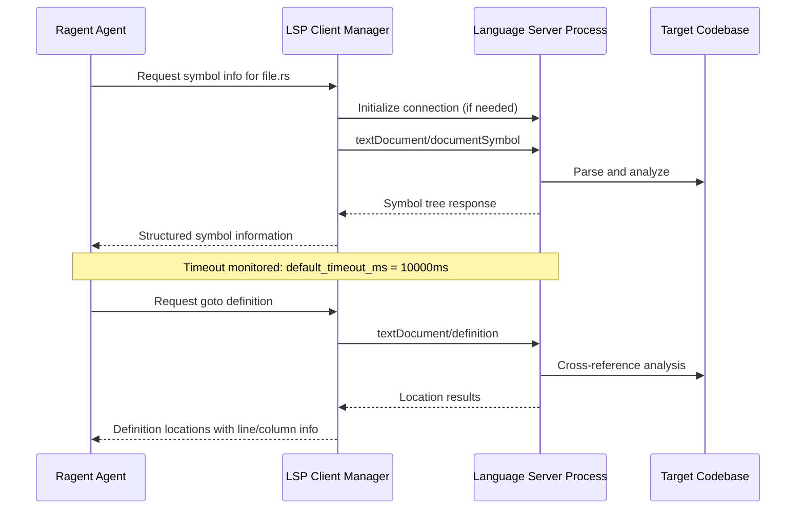

# LspServerConfig

**Type:** technology

### From: mod

The `LspServerConfig` struct enables ragent to leverage the Language Server Protocol (LSP), the de facto standard for code intelligence that originated with Microsoft Visual Studio Code. By supporting LSP, ragent transcends simple text-file understanding to achieve deep code comprehension: cross-reference resolution, type inference, symbol documentation, and real-time diagnostic awareness. This integration transforms ragent from a context-window-limited text processor into a semantically-aware development partner capable of understanding project structure at scale.

The configuration design reflects LSP's process-based architecture. Language servers execute as separate processes—often heavy JVM or Node.js applications—communicating via JSON-RPC over stdin/stdout. The `command` field specifies the server executable, with `args` supporting necessary initialization flags (some servers require explicit `--stdio` flags). Environment variable injection enables credential provisioning for proprietary language servers and customization of runtime behavior. Extension mapping connects file types to appropriate servers, crucial for polyglot projects where multiple servers may serve the same codebase.

Timeout configuration (default 10,000ms) addresses the reality that LSP operations vary dramatically in duration: symbol lookup may complete in milliseconds, while workspace-wide refactoring analysis or complex type inference in deeply nested generic code may require substantial computation. The default balances responsiveness against completeness, with `must_use` attributes encouraging callers to handle potential timeouts gracefully. This integration exemplifies ragent's philosophy of augmenting rather than replacing established developer tooling—leveraging the millions of engineering hours invested in language servers rather than reimplementing language semantics. The `disabled` flag enables selective server management, useful for troubleshooting or working in resource-constrained environments.

## Diagram

## External Resources

- [Official Language Server Protocol specification](https://microsoft.github.io/language-server-protocol/) - Official Language Server Protocol specification
- [rust-analyzer, the Rust language server](https://rust-analyzer.github.io/) - rust-analyzer, the Rust language server
- [TypeScript language server implementation](https://github.com/typescript-language-server/typescript-language-server) - TypeScript language server implementation
- [JSON-RPC 2.0 specification for LSP communication](https://jsonrpc.org/specification) - JSON-RPC 2.0 specification for LSP communication

## Sources

- [mod](../sources/mod.md)
