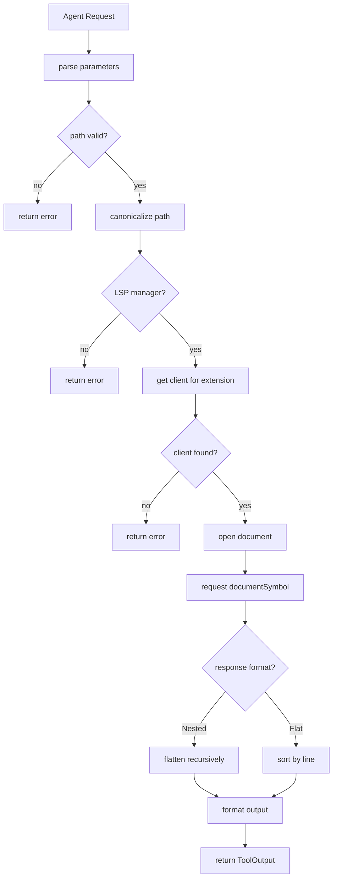

# LspSymbolsTool

**Type:** technology

### From: lsp_symbols

LspSymbolsTool is a Rust struct implementing the Tool trait that provides automated extraction of document symbols from source code files via Language Server Protocol. The tool acts as an intelligent interface between AI agents and language-specific semantic analysis capabilities, transforming raw LSP responses into structured, human-readable output. It was designed to solve the common problem of code comprehension in automated workflows, where agents need to understand file structure without manually parsing source code.

The tool's architecture reflects modern Rust async patterns and robust error handling philosophies. It requires a configured LSP manager in the tool context, which maintains connections to various language servers based on file extensions. When executed, the tool performs a series of validation steps: parameter extraction, path canonicalization, LSP client resolution, document opening, and finally the symbol query itself. This multi-stage pipeline ensures that meaningful error messages are propagated when configuration issues occur, such as missing LSP servers for specific file types.

A distinguishing feature of LspSymbolsTool is its handling of dual response formats from LSP servers. The DocumentSymbolResponse can be either Nested (hierarchical with parent-child relationships) or Flat (linear list with location information). The tool normalizes both formats into a consistent output through the flatten_symbol recursive function, which traverses hierarchical structures while preserving depth information for visual indentation. This normalization ensures that consumers receive predictable output regardless of the underlying LSP server's response format preferences.

The tool integrates with a permission system through its `lsp:read` category, allowing fine-grained access control in multi-agent environments. It generates rich metadata including symbol counts and file paths, enabling downstream tools to make informed decisions about further analysis. The output format uses fixed-width columns for kind, name, and line number, making it suitable for both human inspection and automated parsing by subsequent processing stages.

## Diagram

## External Resources

- [Official Language Server Protocol specification defining textDocument/documentSymbol](https://microsoft.github.io/language-server-protocol/specifications/specification-current/) - Official Language Server Protocol specification defining textDocument/documentSymbol
- [Rust lsp-types crate documentation for LSP type definitions](https://docs.rs/lsp-types/latest/lsp_types/) - Rust lsp-types crate documentation for LSP type definitions
- [async-trait crate enabling async methods in traits](https://crates.io/crates/async-trait) - async-trait crate enabling async methods in traits

## Sources

- [lsp_symbols](../sources/lsp-symbols.md)
