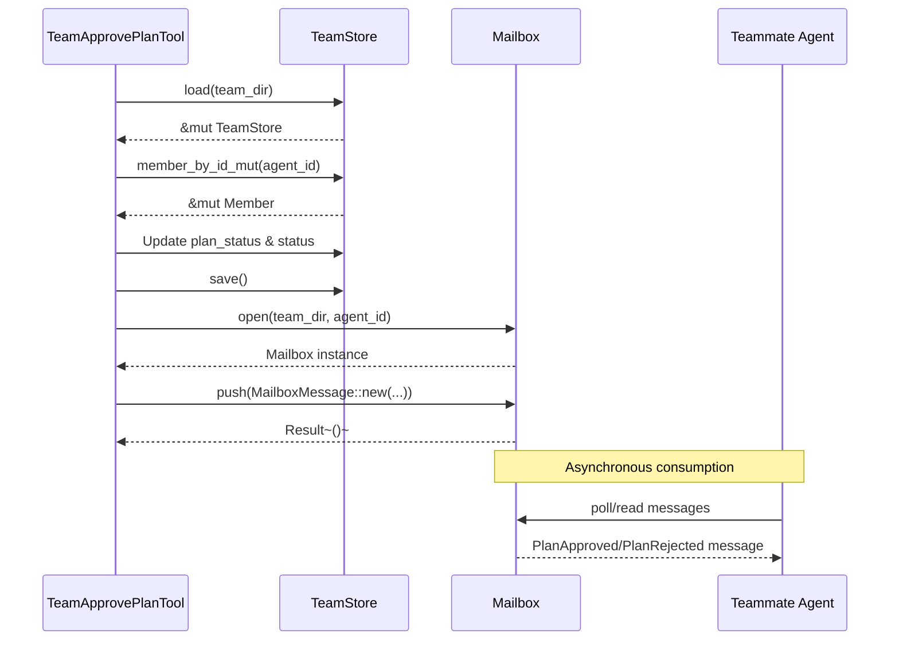

# Mailbox

**Type:** technology

### From: team_approve_plan

Mailbox is an asynchronous message passing abstraction that enables reliable communication between team lead and teammates in this distributed agent system. The implementation follows a persistent mailbox pattern where messages are durably stored, ensuring delivery even if recipients are temporarily unavailable. The `open` constructor takes team directory and agent identifier parameters, suggesting per-agent mailbox isolation within team-scoped storage. This design enables multi-tenant deployments where multiple teams coexist without message leakage.

The Mailbox API emphasizes simplicity and reliability over advanced features like priority queues or message filtering. The `push` method accepts `MailboxMessage` instances and persists them atomically, returning `Result` to signal success or storage failures. This minimal interface belies sophisticated underlying implementation likely handling file locking, atomic writes, and potential network synchronization in distributed deployments. The separation of message creation (`MailboxMessage::new`) from delivery (`push`) enables message inspection, transformation, or batching before final dispatch.

Message types are explicitly typed through the `MessageType` enum, with `PlanApproved` and `PlanRejected` variants indicating first-class support for workflow state notifications. This typed approach prevents stringly-typed message protocols that are error-prone and difficult to evolve. The presence of sender and receiver identifiers in message construction supports audit logging, reply routing, and provenance tracking. The mailbox system thus serves dual purposes: immediate notification delivery and historical record maintenance for compliance and debugging purposes.

## Diagram

## External Resources

- [Message queue pattern for asynchronous communication](https://en.wikipedia.org/wiki/Message_queue) - Message queue pattern for asynchronous communication
- [Rust Result type for explicit error handling](https://doc.rust-lang.org/std/result/) - Rust Result type for explicit error handling

## Sources

- [team_approve_plan](../sources/team-approve-plan.md)

### From: team_broadcast

Mailbox implements asynchronous message queuing for individual agents within the ragent-core framework, providing reliable store-and-forward communication semantics between distributed entities. The design follows the actor model's mailbox pattern where each agent maintains a dedicated queue for incoming messages, decoupling senders from receivers and enabling temporal independence in agent operations. This architecture supports both synchronous and asynchronous communication patterns while providing natural backpressure handling through queue capacity management.

The `Mailbox::open` constructor establishes a connection to a specific agent's message queue within a team directory, using the agent identifier to locate the appropriate persistence location. Messages are appended through the `push` method, which likely implements atomic write operations to prevent message loss during concurrent access or system crashes. The `MailboxMessage` type encapsulates message metadata including sender identification, recipient addressing, message type classification, and payload content—enabling rich routing and filtering capabilities.

The integration with `TeamBroadcastTool` demonstrates the mailbox's role in collective communication patterns: the same primitive used for point-to-point messaging scales naturally to broadcast scenarios through iteration. This uniformity reduces conceptual complexity for tool developers while the underlying implementation can optimize for different access patterns. The filesystem-backed persistence enables agent recovery and message durability across process restarts, critical for long-running autonomous systems where message loss could disrupt coordination protocols or lose critical task assignments.

### From: team_message

Mailbox is a filesystem-backed message queue abstraction that provides durable, asynchronous communication between agents in the system. The implementation suggests a design where each agent maintains a dedicated mailbox file or directory within the team's workspace, enabling message persistence across process restarts and providing a simple, robust communication mechanism without requiring external message brokers. This architectural choice prioritizes operational simplicity and debuggability over high-performance distributed messaging.

The Mailbox API exposed in this code follows a resource-acquisition pattern, with `Mailbox::open()` taking a team directory path and agent identifier to locate or initialize the appropriate storage location. The `push` method accepts a `MailboxMessage` struct, indicating a strongly-typed internal representation that likely handles serialization concerns internally. The use of the `?` operator throughout suggests that mailbox operations can fail in expected ways—permissions issues, disk full conditions, or concurrent access scenarios—and these failures propagate to the tool's caller with appropriate context.

In the broader ecosystem, Mailbox likely implements additional methods not shown here, such as `pop`, `peek`, or `drain` for message retrieval, and possibly subscription mechanisms for reactive notification. The coexistence of `Mailbox` with `TeamStore` and `TeamStoreConfig` hints at a layered persistence architecture: configuration in structured JSON files, messages in mailbox storage, and potentially additional state in other specialized stores. This separation allows each subsystem to optimize for its access patterns while maintaining clear boundaries between concerns.

### From: team_read_messages

Mailbox represents a persistent, filesystem-backed message queue abstraction within the ragent-core team communication subsystem. This entity provides the foundational storage mechanism enabling reliable message delivery between agents in a distributed multi-agent environment. The Mailbox implementation likely employs a directory-per-agent structure within the team's workspace, using atomic file operations or database transactions to ensure message integrity during concurrent access scenarios. The exposed interface includes the critical `open` constructor, which establishes a connection to a specific agent's message store, and the `drain_unread` method, which atomically retrieves and removes pending messages from the queue.

The design philosophy underlying Mailbox reflects lessons from distributed systems engineering, particularly the need for durability guarantees in inter-process communication. Unlike in-memory message passing, the filesystem-backed approach ensures messages survive process crashes, system restarts, and temporary agent unavailability. This persistence model supports sophisticated operational patterns such as delayed message processing, offline agent capabilities, and comprehensive communication auditing. The atomic drain operation prevents the classic "lost message" problem where a crash during processing might leave a message in an ambiguous partially-consumed state.

From an implementation perspective, Mailbox likely manages multiple message states (unread, read, archived) through file naming conventions, subdirectories, or embedded metadata. The message structure consumed by TeamReadMessagesTool reveals rich metadata including unique identifiers, sender attribution, message typing, temporal provenance, and content payload. This structured approach enables flexible message routing policies, content-based filtering, and type-safe deserialization. The integration with standard Rust error handling patterns through the Result type ensures that filesystem failures, permission errors, or corruption scenarios are propagated appropriately to calling code.

### From: team_shutdown_ack

Mailbox is an asynchronous message passing abstraction that enables reliable communication between agents in the ragent-core multi-agent coordination system. This component implements a mailbox metaphor where each agent (particularly the team lead) maintains a dedicated message queue that other agents can append to, providing a decoupled communication mechanism that doesn't require direct network connections or process-to-process coupling. The Mailbox design supports the reliable delivery of lifecycle events such as shutdown acknowledgments, task completions, and status updates.

The Mailbox abstraction encapsulates several distributed systems concerns including message durability, ordering guarantees, and addressing semantics. The open method establishes a handle to a named mailbox within a team directory context, while the push method enables fire-and-forget message delivery with structured payload types. This design choice reflects practical trade-offs in multi-agent systems: by using filesystem-backed queues rather than in-memory channels, messages survive agent crashes and can be consumed at the recipient's pace rather than requiring simultaneous availability.

In the context of TeamShutdownAckTool, the Mailbox serves as the critical notification pathway that completes the graceful shutdown handshake. After persisting the stopped status via TeamStore, the tool opens the lead's mailbox and pushes a MailboxMessage with MessageType::ShutdownAck, ensuring that the team lead receives definitive confirmation of the shutdown. This two-phase approach—state persistence followed by notification—provides at-least-once delivery semantics and enables lead agents to implement timeout and retry policies for teammates that fail to acknowledge shutdown requests.

### From: team_shutdown_teammate

Mailbox represents the asynchronous message passing infrastructure enabling reliable communication between agents in the ragent-core distributed system, functioning as a persistent queue abstraction that decouples message senders from receivers. In the context of TeamShutdownTeammateTool, the Mailbox serves as the delivery mechanism for ShutdownRequest messages, ensuring that termination notifications reach their intended recipients even if those recipients are temporarily unavailable or processing other tasks. The Mailbox::open operation followed by push demonstrates a transactional pattern where messages are durably enqueued before the tool completes its execution, providing at-least-once delivery semantics essential for coordination protocols.

The Mailbox architecture likely implements per-agent queue isolation, with each agent_id possessing its own dedicated message queue stored within the team's directory structure. This design prevents head-of-line blocking where one slow receiver could delay messages to other agents, and enables independent scaling and management of individual agent mailboxes. The MessageType enumeration—including the ShutdownRequest variant—provides type-safe message categorization that enables receivers to apply appropriate handling logic based on message semantics rather than parsing raw content. This typed approach reduces errors in message handling and supports compile-time verification of protocol implementations.

Integration between Mailbox and TeamStore creates a two-phase commitment pattern for shutdown coordination: first the persistent state is updated to reflect intent (ShuttingDown status), then the notification is enqueued for delivery. This ordering ensures that even if message delivery fails temporarily, the system state accurately reflects the shutdown intent, and retry mechanisms can eventually succeed. The Mailbox abstraction hides implementation complexities such as file locking, serialization formats, and concurrency control from tool implementers, presenting a clean push-based interface that aligns with actor-model communication patterns prevalent in distributed systems design.
