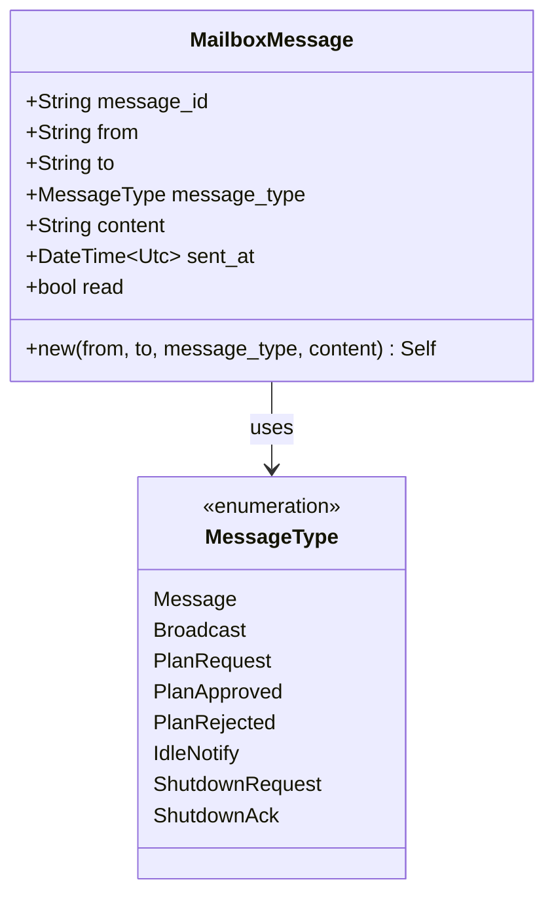

# MailboxMessage

**Type:** technology

### From: mailbox

The `MailboxMessage` struct serves as the fundamental unit of communication in the RAgent mailbox system, representing a single message exchanged between agents. Each message carries a rich set of metadata including a UUID v4-based `message_id` for unique identification, `from` and `to` fields indicating sender and recipient (which can be specific agent IDs or the special value `"lead"` for the team lead), a `message_type` categorizing the semantic purpose, human-readable `content`, UTC timestamp `sent_at`, and a boolean `read` flag tracking consumption status.

The struct derives several important traits: `Debug` and `Clone` for development ergonomics, and critically `Serialize`/`Deserialize` from the `serde` crate for JSON persistence. The `message_type` field uses serde's rename attribute to serialize as `"type"` in JSON while avoiding the Rust keyword conflict. This design enables flexible message content—from free-form chat to structured plan submissions—while maintaining type safety through the `MessageType` enum.

The `new` constructor method demonstrates idiomatic Rust API design, accepting `impl Into<String>` for flexibility while internally generating the UUID and timestamp automatically. This ensures message uniqueness and temporal accuracy without burdening callers. The `read` flag defaults to `false`, establishing an implicit protocol where messages are considered unread until explicitly processed by the recipient, supporting patterns like `drain_unread` for batch processing.

## Diagram

## External Resources

- [UUID crate documentation for RFC 4122 compliant identifiers](https://docs.rs/uuid/latest/uuid/) - UUID crate documentation for RFC 4122 compliant identifiers
- [Serde serialization framework documentation](https://docs.rs/serde/latest/serde/) - Serde serialization framework documentation
- [Chrono date/time library for Rust](https://docs.rs/chrono/latest/chrono/) - Chrono date/time library for Rust

## Sources

- [mailbox](../sources/mailbox.md)
