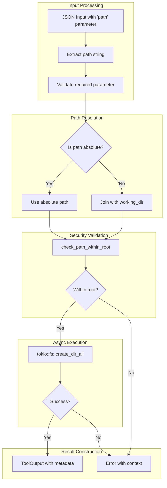

# MakeDirTool

**Type:** technology

### From: mkdir

MakeDirTool is a concrete struct implementation within the ragent-core crate that provides directory creation functionality as part of an AI agent's tool ecosystem. The struct itself is a zero-sized type (unit struct), serving as a marker type that implements the Tool trait without requiring any internal state storage. This design pattern enables efficient, clone-free instantiation of tools while maintaining full trait compliance. The tool's primary responsibility is to create directories on the filesystem, including all necessary parent directories, making it functionally equivalent to the Unix `mkdir -p` command. The implementation demonstrates modern Rust asynchronous programming patterns by utilizing tokio's filesystem abstractions rather than blocking std::fs operations, which is critical for maintaining performance in concurrent agent systems that may invoke multiple tools simultaneously.

The tool integrates into a broader permission system through its `permission_category` method, which returns "file:write"—categorizing this operation as a write-level file system interaction. This categorization enables coarse-grained access control policies where system administrators or security configurations can restrict agent capabilities based on operation types. The execute method orchestrates the actual directory creation workflow: extracting parameters from JSON input, resolving relative paths against the agent's working directory, validating security constraints through path traversal checks, performing the async directory creation, and returning structured output with both human-readable messages and machine-parseable metadata. The error handling strategy employs anyhow's context propagation to provide clear, actionable error messages while preserving the underlying error chain for debugging purposes.

From an architectural perspective, MakeDirTool exemplifies the plugin-style tool system used throughout ragent-core, where capabilities are modularized into discrete units that can be dynamically discovered and invoked. The JSON Schema-based parameter definition enables runtime validation and integration with LLM function-calling interfaces, where language models can understand required parameters and generate properly structured calls. The tool's idempotent behavior—succeeding when directories already exist rather than failing—aligns with infrastructure-as-code principles and repeated execution safety, crucial for autonomous agents that may retry operations or execute idempotent task sequences. The metadata returned in ToolOutput includes the resolved path, enabling downstream tools or logging systems to track exactly which filesystem locations were modified during agent execution.

## Diagram

## External Resources

- [tokio::fs::create_dir_all documentation for async directory creation](https://docs.rs/tokio/latest/tokio/fs/fn.create_dir_all.html) - tokio::fs::create_dir_all documentation for async directory creation
- [Rust PathBuf documentation for cross-platform path manipulation](https://doc.rust-lang.org/std/path/struct.PathBuf.html) - Rust PathBuf documentation for cross-platform path manipulation
- [Serde serialization framework for Rust JSON handling](https://serde.rs/) - Serde serialization framework for Rust JSON handling

## Sources

- [mkdir](../sources/mkdir.md)
