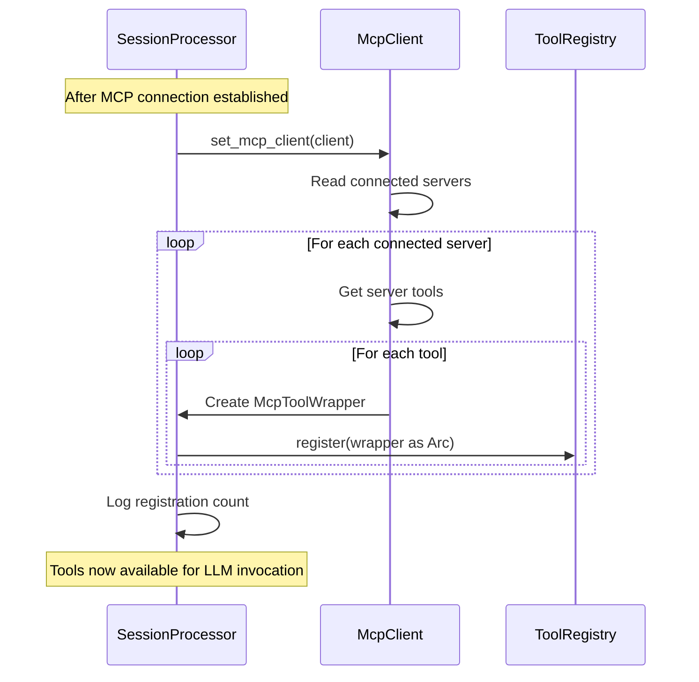

# MCP (Model Context Protocol)

**Type:** technology

### From: processor

The Model Context Protocol (MCP) is an open protocol for extending LLM applications with external tools and resources, mentioned in this codebase through the `McpClient`, `McpToolWrapper`, and `set_mcp_client` method. MCP enables dynamic tool discovery and registration from external servers, allowing the agent system to integrate with diverse tool ecosystems without hardcoded dependencies. The protocol supports server capabilities including tool definitions with JSON Schema parameters and execution endpoints.

The `SessionProcessor` integrates MCP through a deferred initialization pattern: the `mcp_client` field uses `OnceLock` to accept the client after construction, then `set_mcp_client` performs dynamic tool registration. This method scans connected MCP servers, filters for those with `McpStatus::Connected`, and registers each tool with a prefixed name format `mcp_{server_id}_{tool_name}`. The `McpToolWrapper` struct adapts MCP tool definitions to the processor's internal `ToolRegistry` interface, enabling transparent invocation alongside native tools.

The implementation demonstrates production MCP integration concerns including status-aware filtering (only registering from connected servers), structured logging of registration events with server and tool identifiers, and graceful handling of empty tool sets. The tracing instrumentation at debug and info levels supports operational observability, while the Arc-wrapped RwLock pattern for the client enables concurrent access across the async runtime. MCP's growing ecosystem significance positions this as a strategic integration point for extending agent capabilities.

## Diagram

## External Resources

- [Official Model Context Protocol specification](https://modelcontextprotocol.io/) - Official Model Context Protocol specification
- [MCP protocol implementations and SDKs](https://github.com/modelcontextprotocol) - MCP protocol implementations and SDKs

## Sources

- [processor](../sources/processor.md)
