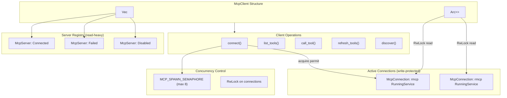

# McpClient

**Type:** technology

### From: mod

The central orchestrator for MCP server connections in the RAgent Core system, implemented as a thread-safe async-capable client. McpClient maintains two primary data structures: a vector of McpServer metadata records and an Arc<RwLock<HashMap>> containing active McpConnection instances. This dual-structure design separates immutable server configuration from mutable connection state, enabling efficient read-heavy operations like tool listing while protecting concurrent connection management. The client implements comprehensive lifecycle management including connection establishment with validation, tool discovery and caching, invocation routing, and graceful disconnection with resource cleanup. The implementation uses tokio's async RwLock for non-blocking concurrent access and a static Semaphore to limit concurrent process spawns, preventing resource exhaustion attacks.

McpClient provides two categories of tool invocation methods: explicit server targeting via `call_tool` and automatic resolution via `call_tool_by_name`. The latter searches across all connected servers to find the owning server, simplifying client code when the server topology is dynamic. Tool definitions are cached at connection time and can be refreshed individually or in bulk, with proper error isolation so one server's failure doesn't cascade to others. The client integrates with the `rmcp` SDK's ServiceExt trait for transport abstraction, supporting both TokioChildProcess for stdio servers and StreamableHttpClientTransport for network-based servers. This polymorphic transport handling allows the same client code to work with local CLI tools, remote HTTP endpoints, or Server-Sent Event streams without modification.

The implementation demonstrates sophisticated error handling patterns, using `anyhow` for ergonomic error propagation while preserving context through structured logging. Each server connection attempt captures detailed error information in the McpStatus::Failed variant, enabling operational visibility into connection failures. The client also implements a discover() method that delegates to the discovery module, enabling zero-configuration scenarios where available MCP servers are automatically detected from system paths and package managers. This positions McpClient as both a programmatic API for embedded use and a foundation for interactive configuration tools.

## Diagram

## External Resources

- [rmcp crate documentation - official Rust SDK for Model Context Protocol](https://docs.rs/rmcp/latest/rmcp/) - rmcp crate documentation - official Rust SDK for Model Context Protocol
- [Model Context Protocol specification and documentation](https://modelcontextprotocol.io/) - Model Context Protocol specification and documentation
- [Tokio - Rust async runtime used for I/O and synchronization](https://tokio.rs/) - Tokio - Rust async runtime used for I/O and synchronization

## Sources

- [mod](../sources/mod.md)
