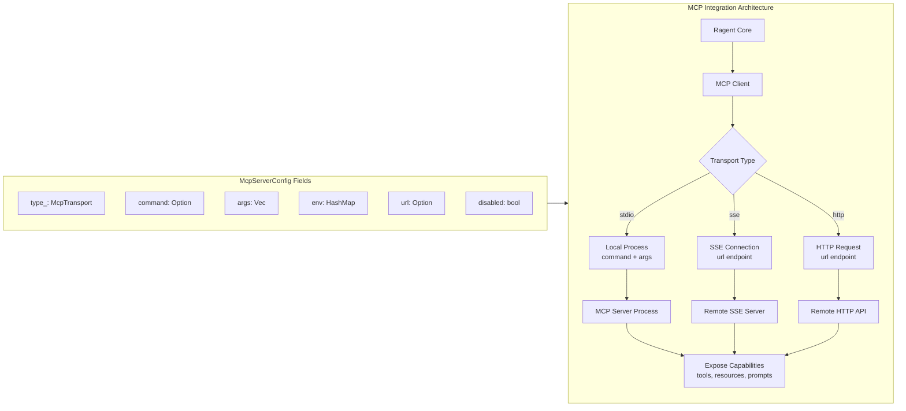

# McpServerConfig

**Type:** technology

### From: mod

The `McpServerConfig` struct implements configuration for the Model Context Protocol (MCP), an emerging standard that positions ragent within the growing ecosystem of interoperable AI tools. MCP represents a significant architectural shift from monolithic agent design toward composable capability systems, where specialized tools expose standardized interfaces that any compatible agent can leverage. This configuration enables dynamic extension of ragent's capabilities without code modification, supporting tools for database query, web search, file system operations, and domain-specific enterprise integrations.

The transport abstraction in `McpTransport` enum reflects real-world deployment diversity. Stdio transport enables simple local tool invocation where the MCP server runs as a child process, ideal for development environments and trusted local tools. SSE (Server-Sent Events) transport supports persistent connections to remote services, enabling stateful tool sessions and real-time data streaming. HTTP transport provides stateless request-response patterns suitable for cloud-hosted API-style tools. This multimodal approach acknowledges that enterprise AI infrastructure spans edge devices, on-premises servers, and cloud services.

Configuration fields support complete lifecycle management: executable specification with argument vectors for local processes, environment variable injection for credential management, URL endpoints for remote services, and disabled flags for graceful degradation. The default implementation selects stdio transport, lowering barrier to entry for tool developers. Security considerations manifest through explicit command and environment control rather than implicit PATH inheritance, following principle of least privilege. This struct exemplifies how ragent embraces external standards while maintaining operational flexibility, positioning the framework for integration with the expanding MCP ecosystem being developed by Anthropic and community contributors.

## Diagram

## External Resources

- [Model Context Protocol official documentation and specification](https://modelcontextprotocol.io/) - Model Context Protocol official documentation and specification
- [Anthropic's announcement of the MCP specification](https://www.anthropic.com/news/model-context-protocol) - Anthropic's announcement of the MCP specification
- [Server-Sent Events (SSE) protocol for streaming transport](https://developer.mozilla.org/en-US/docs/Web/API/Server-sent_events) - Server-Sent Events (SSE) protocol for streaming transport
- [JSON-RPC specification underlying LSP and MCP communication](https://jsonrpc.org/) - JSON-RPC specification underlying LSP and MCP communication

## Sources

- [mod](../sources/mod.md)
