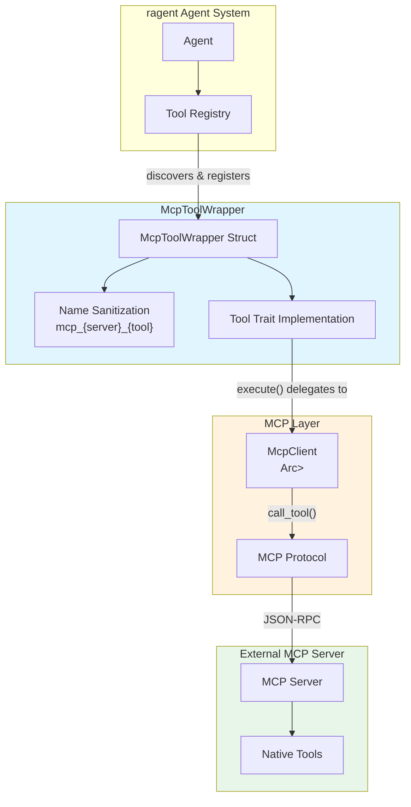

# McpToolWrapper

**Type:** product

### From: mcp_tool

The `McpToolWrapper` struct is the central abstraction in this module, designed to encapsulate a single tool provided by an MCP server and expose it through the ragent `Tool` trait interface. This architectural component solves the fundamental challenge of tool interoperability in agent systems—how to incorporate external tools that follow different protocols without polluting the core agent framework with protocol-specific code. The wrapper maintains complete metadata about the underlying MCP tool, including its originating server ID, original tool name, generated ragent-safe name, human-readable description, and JSON Schema for input validation.

The design of `McpToolWrapper` reflects careful consideration of naming conflicts and identifier safety. The `ragent_name` field is constructed through a deterministic transformation process that prefixes sanitized server and tool identifiers with `mcp_`, creating a flat namespace that prevents collisions while maintaining traceability to the source. This approach allows multiple MCP servers to provide tools with identical names without conflict, as each receives a unique qualified identifier. The sanitization process specifically targets characters that could cause issues in various contexts—hyphens, periods, and slashes are replaced with underscores to ensure compatibility across different systems and storage mechanisms.

The struct leverages Rust's ownership and concurrency model through `Arc<RwLock<McpClient>>`, enabling shared access to the MCP client across multiple tool wrappers while permitting safe mutation when necessary. This pattern is essential for efficiency, as a single MCP client connection can serve numerous tools from the same server. The `RwLock` provides read-heavy optimization, assuming that tool execution (requiring read access) far outnumbers client reconfiguration events. The JSON Schema stored in `input_schema` enables runtime validation and automatic UI generation for tool parameters, supporting both programmatic invocation and interactive use cases.

## Diagram

## External Resources

- [Model Context Protocol specification and documentation](https://modelcontextprotocol.io/) - Model Context Protocol specification and documentation
- [async_trait crate documentation for async trait implementation](https://docs.rs/async-trait/latest/async_trait/) - async_trait crate documentation for async trait implementation

## Sources

- [mcp_tool](../sources/mcp-tool.md)
