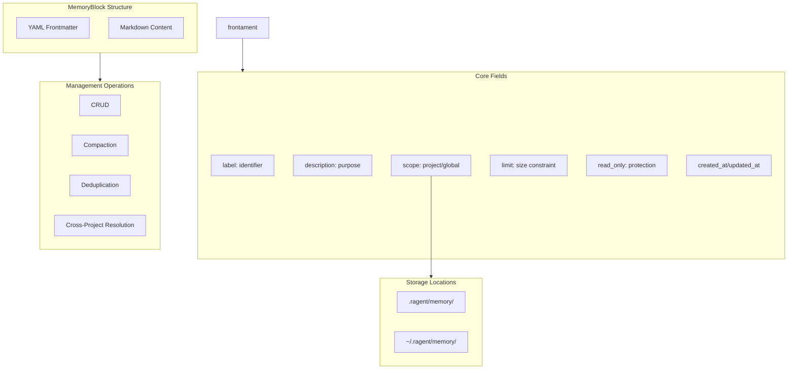

# MemoryBlock

**Type:** technology

### From: mod

MemoryBlock is the fundamental unit of persistence in ragent's memory system, representing a structured, named container for agent knowledge. Each MemoryBlock is stored as a Markdown file with YAML frontmatter, creating a human-readable and version-control-friendly format that bridges machine-processable metadata with natural language content. The block format includes standard fields such as label (the block's identifier), description (human-readable purpose), scope (project or global), limit (size constraints), read_only status, and timestamps for creation and modification tracking. This design enables both programmatic manipulation and direct human editing, making the memory system transparent and maintainable.

The MemoryBlock abstraction supports sophisticated memory management operations including compaction, deduplication, and cross-project resolution. Blocks can be marked as read-only to preserve critical knowledge, or configured with size limits to prevent unbounded growth. The scope field enables a hierarchical memory architecture where project-specific patterns coexist with global best practices. When combined with the BlockScope enum, MemoryBlock instances form a unified namespace where agents can resolve memory references across different contexts, enabling knowledge reuse and consistency across multiple projects.

The implementation leverages Rust's type system to ensure memory safety and zero-cost abstractions, with the block module providing core functionality for CRUD operations, validation, and serialization. The choice of Markdown with YAML frontmatter reflects modern developer tooling preferences, enabling syntax highlighting in editors, diff-friendly version control, and easy inspection without specialized tools. This format also facilitates interoperability with other systems and manual curation of agent knowledge bases.

## Diagram

## External Resources

- [YAML specification for frontmatter syntax](https://yaml.org/spec/) - YAML specification for frontmatter syntax
- [Markdown syntax documentation](https://daringfireball.net/projects/markdown/syntax) - Markdown syntax documentation

## Sources

- [mod](../sources/mod.md)

### From: defaults

The `MemoryBlock` type represents the fundamental data structure for persistent memory within the ragent system, encapsulating labeled content with associated metadata and scoping information. This type serves as the primary unit of information exchange between the agent's runtime memory and persistent storage implementations. The structure likely contains fields for a unique label identifier, a scope designation indicating whether the block is project-local or global, an optional description for human readability, and the actual content payload as a string.

The implementation of `MemoryBlock` demonstrates sophisticated use of Rust's builder pattern, as evidenced by the `with_description` and `with_content` methods used in the seeding logic. The `new` constructor accepts required parameters (label and scope), returning a partially-initialized block, while subsequent builder methods enable optional field configuration. This approach provides ergonomic API usage—callers can chain configuration methods while the type system ensures required fields are populated. The ownership model is carefully considered: label and scope likely use owned `String` or borrowed equivalents, while content is accepted as `String` requiring explicit conversion from string literals via `to_string()`.

The `MemoryBlock` abstraction enables the memory system to remain content-agnostic while providing structural guarantees. The system doesn't need to understand whether a block contains Markdown, JSON, or plain text; it treats all content uniformly as strings while preserving the structural relationships between labels, scopes, and descriptions. This flexibility allows the same underlying infrastructure to support diverse memory types—agent personas, user preferences, project documentation, conversation history—without specialized handling for each variant. The scope association ensures appropriate isolation between project contexts while enabling shared global state, a crucial capability for maintaining consistent agent behavior across multiple work contexts.
