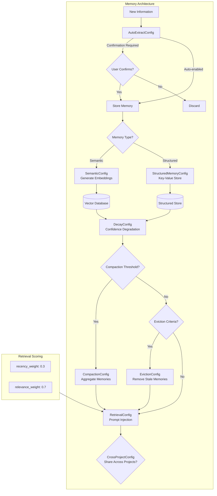

# MemoryConfig

**Type:** technology

### From: mod

The `MemoryConfig` struct represents ragent's sophisticated approach to persistent context management, addressing one of the fundamental challenges in autonomous agent systems: maintaining coherent, relevant, and bounded memory across extended interaction sessions. Unlike simple conversation history, this configuration enables semantic memory through embedding-based retrieval, structured memory for explicit fact storage, and automatic extraction pipelines that identify salient information without explicit user instruction. The architecture reflects lessons from cognitive science and modern retrieval-augmented generation systems.

Semantic memory configuration (`SemanticConfig`) enables vector-based similarity search, allowing agents to recall relevant past interactions based on conceptual similarity rather than exact keyword matching. The default model specification and dimensionality (384 dimensions suggesting all-MiniLM-L6-v2 or similar efficient embedding models) balance accuracy against computational overhead. Retrieval configuration governs how memories surface in prompts, with configurable weights for recency versus relevance—critical for preventing catastrophic forgetting while avoiding stale context injection.

The memory lifecycle management is particularly comprehensive. `DecayConfig` implements confidence-based degradation, simulating how human memory weakens over time unless reinforced. `CompactionConfig` provides scheduled consolidation, aggregating related memories to prevent context explosion. `EvictionConfig` establishes hard boundaries through stale data removal and confidence thresholds. `AutoExtractConfig` with its confirmation requirements enables autonomous learning while maintaining human oversight for sensitive information. Together, these subsystems create a self-managing memory ecology that scales from brief coding sessions to months-long project engagements, with `CrossProjectConfig` optionally enabling knowledge transfer between distinct codebases—controversial for privacy but powerful for organizational learning.

## Diagram

## External Resources

- [Sentence Transformers embedding model likely used for semantic search](https://huggingface.co/sentence-transformers/all-MiniLM-L6-v2) - Sentence Transformers embedding model likely used for semantic search
- [Retrieval-Augmented Generation for Knowledge-Intensive NLP (RAG paper)](https://arxiv.org/abs/2005.11401) - Retrieval-Augmented Generation for Knowledge-Intensive NLP (RAG paper)
- [Ebbinghaus forgetting curve theory underlying memory decay](https://en.wikipedia.org/wiki/Forgetting_curve) - Ebbinghaus forgetting curve theory underlying memory decay
- [Pinecone vector database for semantic search implementations](https://docs.pinecone.io/) - Pinecone vector database for semantic search implementations

## Sources

- [mod](../sources/mod.md)
