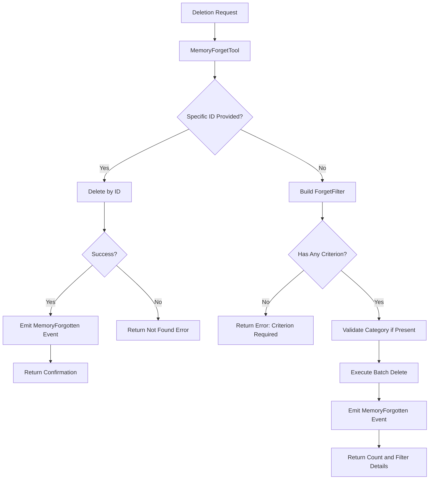

# MemoryForgetTool

**Type:** technology

### From: structured_memory

MemoryForgetTool implements safe deletion mechanisms for the structured memory system, providing both surgical removal of specific memories and batch cleanup operations based on configurable filter criteria. Recognizing that knowledge bases require curation to remain accurate and relevant, this tool enables agents to eliminate outdated information, correct erroneous facts, or purge low-confidence assertions that may have accumulated over extended operation. The design prioritizes safety through mandatory criterion requirements—at least one of id, older_than_days, max_confidence, category, or tags must be specified—preventing accidental deletion of the entire memory store through empty filter objects.

The tool supports two primary deletion modes that are mutually exclusive in execution. Single-ID deletion provides precise removal of specific memories when their identifiers are known, returning immediate confirmation or a not-found error. Filter-based deletion enables broader operations such as removing all memories older than 90 days, purging memories with confidence below 0.3, clearing entire categories that are no longer relevant, or eliminating memories matching specific tag combinations. The ForgetFilter enum encapsulates these criteria with proper type safety, and validation ensures that provided categories match the system's predefined constants before execution.

Upon successful deletion, MemoryForgetTool emits MemoryForgotten events containing the count of affected memories for audit logging and analytics. The tool returns structured output indicating both the count and the specific filter criteria applied, enabling verification that the intended scope was affected. Permission categorization as "file:write" reflects the destructive nature of these operations, requiring appropriate authorization. The implementation handles edge cases including non-existent IDs through explicit error propagation and unreachable code paths for filter variants that should have been processed earlier, demonstrating defensive programming practices appropriate for data destruction operations.

## Diagram

## External Resources

- [anyhow crate for flexible error handling in Rust](https://docs.rs/anyhow/latest/anyhow/) - anyhow crate for flexible error handling in Rust
- [Rust Option type documentation for nullable values](https://doc.rust-lang.org/std/option/enum.Option.html) - Rust Option type documentation for nullable values

## Sources

- [structured_memory](../sources/structured-memory.md)
