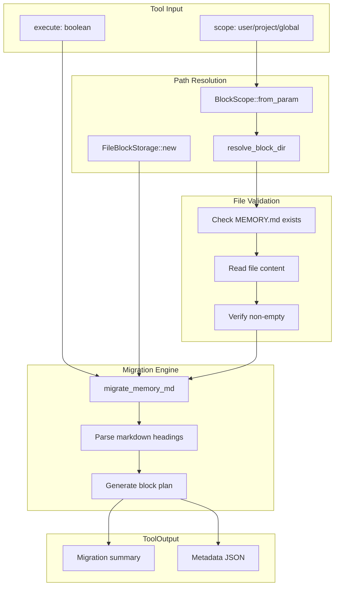

# MemoryMigrateTool

**Type:** product

### From: memory_migrate

MemoryMigrateTool is a specialized migration utility within the ragent-core framework designed to transform flat MEMORY.md files into structured, named memory blocks. This tool represents a critical component in the evolution of AI agent memory architectures, addressing the fundamental tension between human-readable documentation formats and machine-optimized storage structures. The tool operates across three distinct scopes—user, project, and global—enabling fine-grained control over memory organization while maintaining separation between different contextual domains.

The implementation follows a sophisticated dual-mode execution pattern that prioritizes operational safety and user transparency. In its default dry-run mode, the tool analyzes the markdown structure and proposes section boundaries without modifying any files, allowing users to preview the migration outcome before committing changes. When explicitly activated via the `execute` parameter, the tool performs the actual block creation while preserving the original MEMORY.md file, ensuring no data loss during the transition. This design reflects lessons learned from data migration failures in production systems, where irreversible transformations can lead to significant recovery challenges.

The tool's integration with `FileBlockStorage` and `BlockScope` demonstrates a layered storage abstraction that decouples the migration logic from underlying filesystem operations. The `migrate_memory_md` function likely implements heading-aware parsing that respects markdown hierarchy, potentially using algorithms similar to those in static site generators that split content at header boundaries. The resulting named blocks enable more efficient retrieval patterns, allowing agents to load only relevant memory sections rather than entire documents, which directly addresses token limit constraints in large language model contexts.

From a broader architectural perspective, MemoryMigrateTool exemplifies the shift toward modular, composable memory systems in AI agent frameworks. By enabling programmatic migration between storage formats, it supports iterative system evolution without requiring manual data reorganization. The tool's structured JSON output with detailed metadata—including section counts, creation status, and skip decisions—facilitates integration with monitoring and audit systems, supporting compliance requirements in enterprise agent deployments.

## Diagram

## External Resources

- [anyhow crate for flexible error handling in Rust](https://crates.io/crates/anyhow) - anyhow crate for flexible error handling in Rust
- [serde serialization framework documentation](https://serde.rs/) - serde serialization framework documentation
- [async-trait crate for async trait methods in Rust](https://docs.rs/async-trait) - async-trait crate for async trait methods in Rust

## Sources

- [memory_migrate](../sources/memory-migrate.md)
