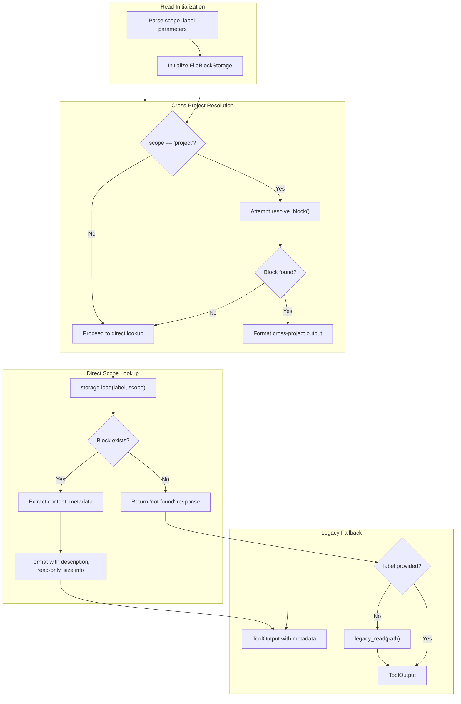

# MemoryReadTool

**Type:** technology

### From: memory_write

MemoryReadTool serves as the retrieval mechanism for the Ragent memory system, enabling agents to access previously stored information with sophisticated scope resolution capabilities. The tool implements a multi-tiered lookup strategy that prioritizes project-local memory blocks while providing fallback to cross-project and global scopes, ensuring maximum information availability while respecting scope boundaries. This design supports advanced use cases where agents need to reference universal knowledge patterns or user preferences regardless of the current project context.

The tool's implementation reveals intricate handling of block metadata, enriching the returned content with descriptive information including file paths, scope identifiers, read-only status, and size utilization metrics. When operating in cross-project resolution mode, the tool can detect shadowing scenarios where a project-local block overrides a global block with the same label, surfacing this information to the agent for appropriate context awareness. The output formatting includes optional metadata annotations that provide transparency about the memory block's characteristics without cluttering the primary content.

MemoryReadTool demonstrates the framework's commitment to robust error handling and informative responses, returning structured metadata even when memory blocks are not found. This enables agents to distinguish between empty memory and missing memory, informing appropriate subsequent actions. The tool's integration with the FileBlockStorage abstraction and the cross_project resolution module showcases the modular architecture of the Ragent memory subsystem, where storage backends and resolution strategies can be extended or replaced without modifying the tool interface.

## Diagram

## External Resources

- [Rust Option type for handling optional values](https://doc.rust-lang.org/std/option/enum.Option.html) - Rust Option type for handling optional values
- [Anyhow error handling library for Rust](https://docs.rs/anyhow/latest/anyhow/) - Anyhow error handling library for Rust

## Sources

- [memory_write](../sources/memory-write.md)
