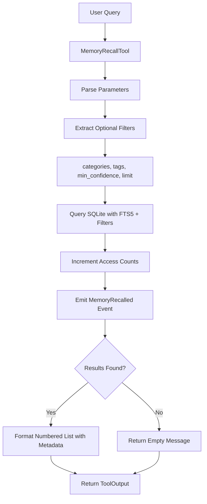

# MemoryRecallTool

**Type:** technology

### From: structured_memory

MemoryRecallTool provides intelligent retrieval capabilities for the structured memory system, implementing full-text search combined with multi-dimensional filtering to surface relevant knowledge from potentially large memory stores. This tool leverages SQLite's FTS5 (Full-Text Search version 5) extension for efficient natural language querying while maintaining the ability to constrain results through category filtering, tag intersection matching, and confidence thresholding. The design reflects a careful balance between search flexibility and result relevance, ensuring agents can access appropriate contextual knowledge without being overwhelmed by low-quality matches.

The tool's parameter schema accepts a required query string that undergoes FTS5 processing, where space-separated terms are treated as conjunctions requiring all terms to match. Optional parameters enable sophisticated filtering: the categories parameter restricts results to specific memory types, the tags parameter requires memories to possess all specified tags (intersection semantics), and min_confidence establishes a quality floor for returned results. The limit parameter controls result set size with a sensible default of five memories to prevent context window overload in language model applications. This layered approach allows precise queries like "deployment errors" in the "error" category with "production" tag and minimum confidence of 0.8.

Execution involves querying the storage backend with the constructed parameters, automatically incrementing access counts for returned memories to support usage analytics and cache warming strategies. The tool emits MemoryRecalled events containing the query and result count for observability. Output formatting presents memories in a numbered list with comprehensive metadata including category, source, confidence score, access frequency, tags, and unique identifier. When no matches are found, the tool provides explicit negative feedback including the query and confidence threshold applied. This transparent reporting helps agents understand the boundaries of their knowledge and potentially adjust confidence thresholds or reformulate queries for better recall.

## Diagram

## External Resources

- [SQLite FTS5 full-text search documentation](https://www.sqlite.org/fts5.html) - SQLite FTS5 full-text search documentation
- [serde_json crate for JSON handling in Rust](https://docs.rs/serde_json/latest/serde_json/) - serde_json crate for JSON handling in Rust

## Sources

- [structured_memory](../sources/structured-memory.md)
