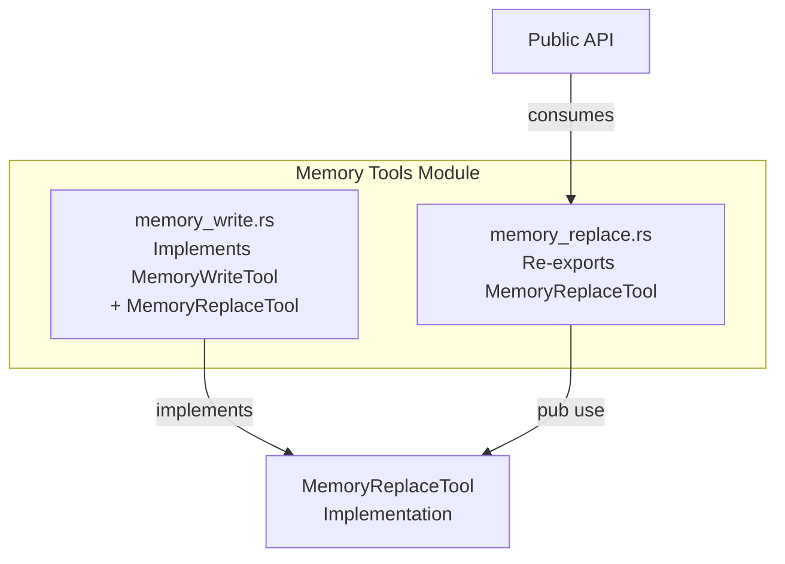

# MemoryReplaceTool

**Type:** technology

### From: memory_replace

The `MemoryReplaceTool` is a specialized tool component within the ragent-core crate designed to handle memory replacement operations in an agent system. While this specific file only re-exports the type, the actual implementation resides in the `memory_write` module where it is developed alongside other memory manipulation tools. This colocation suggests that `MemoryReplaceTool` shares significant implementation details with write operations, likely differing primarily in semantics or specific behavior rather than core mechanics. The tool is part of a larger ecosystem of memory tools that enable agents to modify their working memory state. By being grouped with memory_write, the tool benefits from shared internal utilities, error handling patterns, and type definitions that are common across memory mutation operations. The naming convention indicates this tool performs replacement operations—possibly substituting existing memory entries with new values rather than simply appending or overwriting. This semantic distinction is important in agent systems where memory operations may trigger different side effects, logging behaviors, or validation rules.

## Diagram

## Sources

- [memory_replace](../sources/memory-replace.md)
