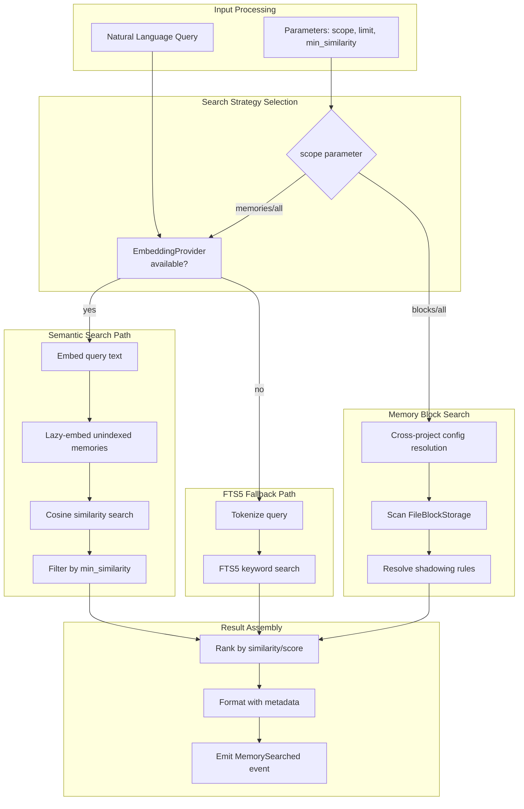

# MemorySearchTool

**Type:** technology

### From: memory_search

MemorySearchTool is a Rust struct implementing the Tool trait that provides unified semantic and keyword-based search across an AI agent's memory systems. The tool encapsulates complex retrieval logic behind a clean interface accepting natural language queries, with automatic backend selection between embedding-based similarity search and traditional full-text search. Its implementation demonstrates sophisticated software engineering practices including strategy pattern for search modes, lazy initialization for embeddings, and graceful degradation when dependencies are unavailable. The tool operates on two distinct storage backends: structured memories in SQLite with rich metadata (categories, confidence scores, tags) and file-based memory blocks with cross-project scoping capabilities.

The tool's architecture enables incremental adoption of semantic search capabilities. Organizations can deploy systems using only FTS5 search, then enable embeddings later without changing calling code. The lazy embedding feature ensures backward compatibility—when semantic search is first enabled, existing memories are automatically embedded on first query rather than requiring batch migration. This design pattern appears in production systems like OpenAI's retrieval implementations and enterprise knowledge bases where data volumes make eager migration prohibitive.

MemorySearchTool integrates deeply with the surrounding agent framework. It participates in the permission system through its "file:read" category, emits structured events for observability, and conforms to the async Tool trait for consistent execution. The cross-project block search with shadowing semantics enables sophisticated multi-tenant scenarios where base knowledge can be specialized per-project without duplication. These features collectively position the tool as a production-grade component for AI systems requiring reliable, observable, and scalable memory retrieval.

## Diagram

## External Resources

- [SQLite FTS5 documentation for full-text search capabilities](https://www.sqlite.org/fts5.html) - SQLite FTS5 documentation for full-text search capabilities
- [OpenAI embeddings guide covering semantic search with vector similarity](https://platform.openai.com/docs/guides/embeddings) - OpenAI embeddings guide covering semantic search with vector similarity
- [Cosine similarity mathematical foundation for semantic search scoring](https://en.wikipedia.org/wiki/Cosine_similarity) - Cosine similarity mathematical foundation for semantic search scoring
- [Vector similarity search concepts and applications in AI systems](https://www.pinecone.io/learn/what-is-similarity-search/) - Vector similarity search concepts and applications in AI systems

## Sources

- [memory_search](../sources/memory-search.md)
