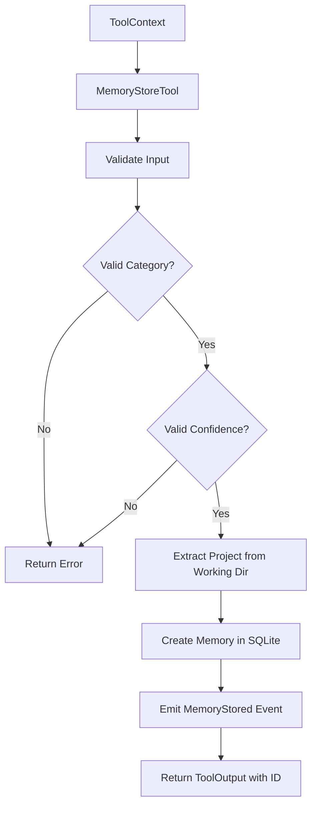

# MemoryStoreTool

**Type:** technology

### From: structured_memory

MemoryStoreTool is a core component of the agent's structured memory system, designed specifically for persisting discrete knowledge elements with rich metadata. This tool implements the Tool trait and provides the primary interface for creating new memories in the SQLite-backed storage system. Each memory stored through this tool represents a single atomic fact, learned pattern, user preference, analytical insight, recorded error, or documented workflow that the agent may need to reference in future interactions. The tool enforces a strict schema that requires content and category fields while supporting optional tags, confidence scores, and source attribution.

The implementation includes comprehensive validation logic that ensures data integrity before persistence. Categories must match predefined constants from MEMORY_CATEGORIES, which standardizes the types of knowledge the system can capture. Confidence scores are validated to fall within the 0.0 to 1.0 range, with a default of 0.7 representing moderately confident assertions. Tags undergo validation through shared logic with the journal system, ensuring consistent formatting with lowercase strings and hyphen support. The tool automatically extracts project context from the working directory name and associates each memory with the current session ID, enabling multi-project isolation and session tracking.

Upon successful storage, MemoryStoreTool emits a MemoryStored event to the event bus, enabling external observers to track knowledge acquisition in real-time. The tool returns formatted output suitable for both human readability and programmatic consumption, including the generated memory ID, normalized metadata, and confirmation details. This event-driven, validation-heavy approach ensures that the agent's knowledge base grows in a controlled, observable manner with clear provenance for each stored fact. The permission category of "file:write" reflects the persistent nature of this operation, requiring appropriate authorization before modifying the underlying database.

## Diagram

## External Resources

- [async-trait crate documentation for async trait methods in Rust](https://docs.rs/async-trait/latest/async_trait/) - async-trait crate documentation for async trait methods in Rust
- [SQLite FTS5 full-text search engine documentation](https://www.sqlite.org/fts5.html) - SQLite FTS5 full-text search engine documentation

## Sources

- [structured_memory](../sources/structured-memory.md)
