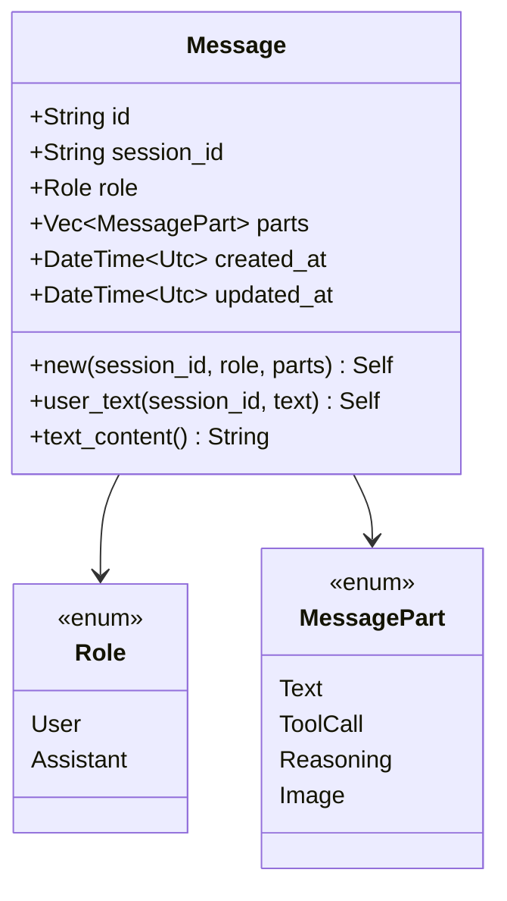

# Message Struct

**Type:** technology

### From: mod

The `Message` struct serves as the central data structure for conversation history in the ragent-core system, representing a single communication unit within a session. Each message carries a UUID v4 identifier for distributed uniqueness, a session identifier for aggregation, a role indicating the sender type, and a vector of message parts that constitute its content. The struct tracks both creation and modification timestamps using UTC datetime, enabling temporal queries and synchronization. The design intentionally separates message metadata from content through the `MessagePart` enum, allowing heterogeneous content types to coexist within a single message while maintaining a uniform interface. The struct provides factory methods including `new()` for general construction and `user_text()` for the common case of simple user messages, demonstrating ergonomic API design. The implementation of `Display` provides a concise preview format useful for logging and debugging, with smart truncation at UTF-8 character boundaries to avoid corrupting multi-byte characters.

## Diagram

## External Resources

- [UUID specification (RFC 4122)](https://www.rfc-editor.org/rfc/rfc4122) - UUID specification (RFC 4122)
- [Rust std::fmt module documentation](https://doc.rust-lang.org/std/fmt/) - Rust std::fmt module documentation

## Sources

- [mod](../sources/mod.md)
