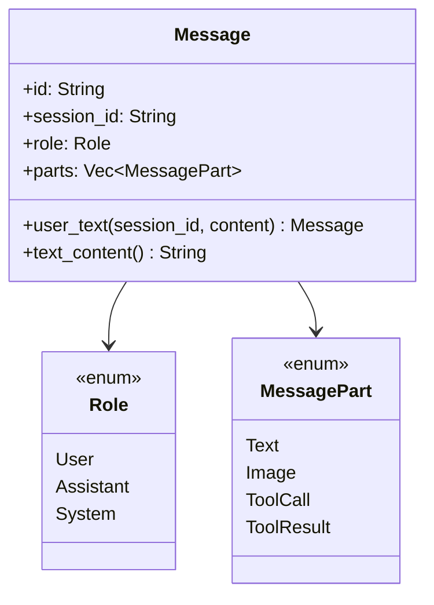

# Message

**Type:** technology

### From: test_message

The `Message` struct represents the core data structure for communication within the Ragent framework, serving as the primary container for information exchanged between agents and users. Based on the test implementations, this struct encapsulates several critical fields including a unique identifier (`id`), session tracking (`session_id`), role classification (`role`), and a collection of message parts (`parts`) that support multimodal content. The struct provides convenient constructor methods such as `user_text()` for creating user-originated text messages, demonstrating an ergonomic API design that abstracts implementation details while ensuring type safety.

The `Message` struct implements or derives serialization capabilities through serde, enabling seamless conversion to and from JSON format as validated by the roundtrip test. This serialization support is essential for distributed agent systems where messages must traverse network boundaries or persist to storage. The struct's design incorporates a `text_content()` method that extracts human-readable text from potentially complex message structures, suggesting support for multimodal content where messages may contain images, tool calls, or other non-textual data alongside or instead of plain text. The comprehensive field validation in the tests—including role verification, session matching, and content extraction—demonstrates that `Message` maintains strong invariants throughout its lifecycle.

## Diagram

## External Resources

- [Rust derive macros for automatic trait implementations](https://doc.rust-lang.org/rust-by-example/attribute/derive.html) - Rust derive macros for automatic trait implementations

## Sources

- [test_message](../sources/test-message.md)
