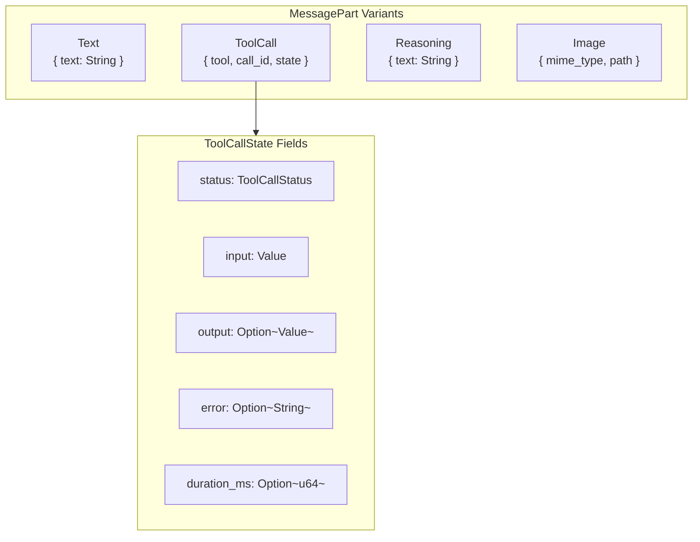

# MessagePart Enum

**Type:** technology

### From: mod

The `MessagePart` enum represents the sum type of all possible content blocks that can constitute a message, enabling rich multimodal conversations. Using serde's internally-tagged serialization with snake_case naming, the enum maps cleanly to JSON representations expected by modern LLM APIs. The four variants cover distinct content categories: `Text` for plain Unicode content, `ToolCall` for executable function invocations with their complete execution state, `Reasoning` for model chain-of-thought that should be distinguished from visible output, and `Image` for binary visual content. The `ToolCall` variant is particularly sophisticated, embedding a complete `ToolCallState` that tracks the lifecycle from invocation through execution to completion or failure. The `Image` variant's design to store filesystem paths rather than base64-encoded data demonstrates production-oriented thinking about database size and memory pressure, deferring actual image loading until API transmission time. This enum architecture allows messages to evolve from simple text exchanges to complex sequences interleaving user queries, model reasoning, tool execution, and visual context.

## Diagram

## External Resources

- [Serde enum representation options](https://serde.rs/enum-representations.html) - Serde enum representation options
- [OpenAI function calling API documentation](https://platform.openai.com/docs/guides/function-calling) - OpenAI function calling API documentation

## Sources

- [mod](../sources/mod.md)
