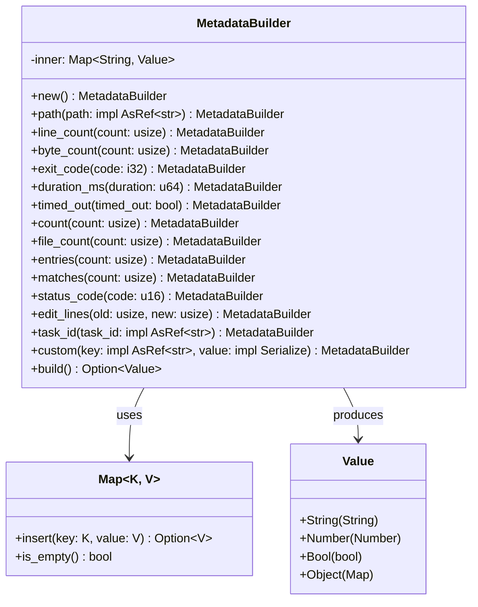

# MetadataBuilder

**Type:** technology

### From: metadata

The `MetadataBuilder` struct is the central abstraction in the RAgent Core metadata module, implementing a fluent builder pattern for constructing standardized JSON metadata objects. This struct maintains internal state through a `serde_json::Map<String, Value>` field named `inner`, which accumulates key-value pairs as methods are called. The struct derives `Debug` and `Default` traits, enabling easy debugging and allowing for alternative construction patterns when needed. The design follows Rust's ownership model precisely, with methods taking `mut self` and returning `Self`, which enables method chaining while ensuring that each builder instance can only be used to create one final metadata object.

The implementation demonstrates sophisticated use of Rust's type system and generic programming. Methods like `path` and `task_id` accept `impl AsRef<str>` parameters, providing flexibility for callers to pass either `String` or `&str` without allocation overhead. The `custom` method uses `impl Serialize` for its value parameter, allowing any serializable type to be included in metadata while handling serialization failures gracefully by silently skipping invalid values. The `#[must_use]` attributes on setter methods indicate that these operations have side effects on the builder state and the return value should not be discarded, preventing subtle bugs where developers might forget to reassign the builder during chaining.

The `MetadataBuilder` serves critical functionality in the broader RAgent ecosystem by ensuring that all tools produce metadata with consistent field names and types. This standardization enables downstream consumers to reliably parse and process tool output metadata without needing tool-specific knowledge. The builder's comprehensive field coverage—from basic file statistics to complex editing operations—reflects the diverse needs of agent-based systems that interact with files, execute commands, perform searches, make HTTP requests, and manage tasks. The `build` method's behavior of returning `Option<Value>` rather than `Value` directly encodes a semantic distinction between "no metadata" and "empty metadata object", which allows for more expressive APIs where the absence of metadata carries meaning distinct from the presence of an empty object.

## Diagram

## External Resources

- [Rust API Guidelines: Builder Pattern](https://doc.rust-lang.org/1.0.0/style/ownership/builders.html) - Rust API Guidelines: Builder Pattern
- [Serde serialization framework documentation](https://serde.rs/) - Serde serialization framework documentation
- [serde_json::Map documentation](https://docs.rs/serde_json/latest/serde_json/map/struct.Map.html) - serde_json::Map documentation

## Sources

- [metadata](../sources/metadata.md)
