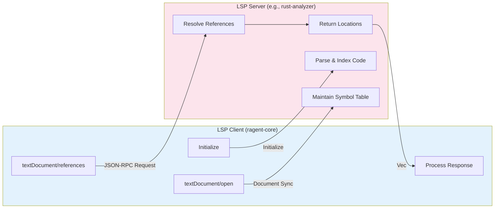

# Microsoft Language Server Protocol (LSP)

**Type:** technology

### From: lsp_references

The Language Server Protocol, developed by Microsoft and now maintained as an open standard, revolutionized how editor-agnostic language support is implemented across the software development ecosystem. Originally created to decouple language-specific logic from Visual Studio Code's editor implementation, LSP has become the de facto standard for implementing features like autocomplete, go-to-definition, hover information, and find-references across dozens of programming languages. The protocol operates on JSON-RPC, allowing language servers to run as separate processes that communicate with any LSP-compatible client, from full IDEs to lightweight editors and, in this case, autonomous agent systems.

The `textDocument/references` method used by LspReferencesTool exemplifies LSP's power: it provides semantic understanding of code that goes far beyond simple text search. When a client sends a references request, the language server performs sophisticated analysis that understands scoping rules, imports, re-exports, and language-specific resolution mechanisms. For Rust code, this means the rust-analyzer server can distinguish between different items with the same name in different modules, find references through type aliases and trait implementations, and handle complex macro expansions. This semantic precision is impossible to achieve with regular expression or even AST-based approaches without reimplementing significant portions of the compiler.

The protocol's design reflects lessons from earlier attempts at universal language support. By standardizing the communication protocol while leaving implementation details to language-specific servers, LSP creates a healthy ecosystem where language communities can build deep, accurate tooling without worrying about editor integration. The partial result and work done progress parameters in LspReferencesTool's usage demonstrate LSP's support for long-running operations, though the current implementation uses default values. The protocol continues to evolve, with new capabilities for call hierarchy, type hierarchy, and inline values expanding what's possible for agent-based code analysis.

## Diagram

## External Resources

- [Official Language Server Protocol documentation](https://microsoft.github.io/language-server-protocol/) - Official Language Server Protocol documentation
- [LSP 3.17 Specification - textDocument/references](https://microsoft.github.io/language-server-protocol/specifications/lsp/3.17/specification/#textDocument_references) - LSP 3.17 Specification - textDocument/references
- [rust-analyzer - LSP server for Rust](https://rust-analyzer.github.io/) - rust-analyzer - LSP server for Rust

## Sources

- [lsp_references](../sources/lsp-references.md)
