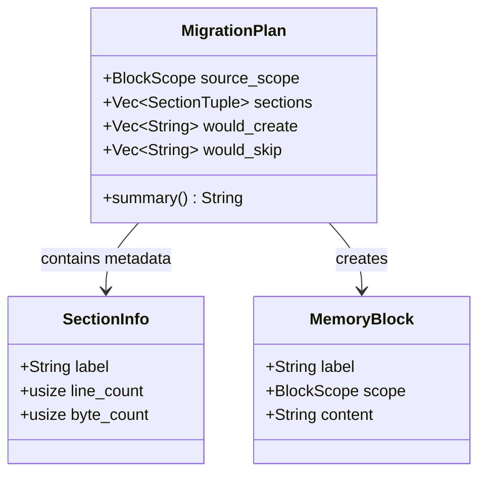

# MigrationPlan

**Type:** product

### From: migrate

MigrationPlan is a core data structure in the ragent memory system that encapsulates the complete analysis and execution plan for transforming a flat MEMORY.md file into structured memory blocks. This struct serves as the primary interface between the migration analysis phase and the execution phase, providing users with comprehensive visibility into what changes would occur before any files are actually modified. The struct tracks the source scope of the migration, maintains a detailed list of all discovered sections with their metadata and content, and explicitly categorizes blocks into those that would be created versus those that would be skipped due to existing conflicts.

The design of MigrationPlan reflects careful consideration of user safety and transparency in data migration operations. Each section entry contains a SectionInfo struct with precise metrics including line counts and byte sizes, the actual content to be written, and a boolean flag indicating whether an existing block would conflict. The separation of `would_create` and `would_skip` vectors enables clear communication to users about potential data conflicts. This architecture supports the dry-run pattern where migrations can be simulated and reviewed without risk, a critical feature for production systems where accidental overwrites could cause significant data loss.

The struct implements a `summary` method that generates human-readable migration reports, demonstrating how programmatic APIs can provide accessible interfaces for both automated systems and human operators. This summary includes the scope being migrated, lists of blocks to be created or skipped, and handles edge cases like empty migrations gracefully. The Debug derive ensures the plan can be logged and inspected during troubleshooting. Overall, MigrationPlan exemplifies defensive programming in data migration tools, prioritizing safety, transparency, and user control over convenience.

## Diagram

## External Resources

- [Rust Debug trait for structured logging](https://doc.rust-lang.org/std/fmt/trait.Debug.html) - Rust Debug trait for structured logging
- [Martin Fowler's work on safe refactoring practices](https://martinfowler.com/books/refactoring.html) - Martin Fowler's work on safe refactoring practices

## Sources

- [migrate](../sources/migrate.md)
