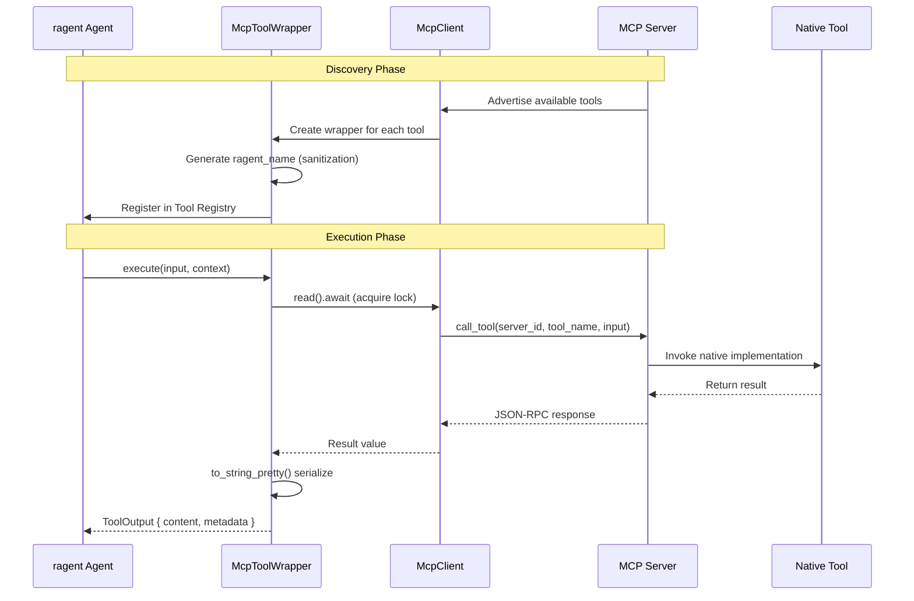

# Model Context Protocol (MCP)

**Type:** technology

### From: mcp_tool

The Model Context Protocol (MCP) is an open protocol standard that enables seamless integration between AI systems and external data sources, tools, and services. Developed to address the fragmentation in how large language models and agent systems connect to external capabilities, MCP establishes a common language for tool advertisement, invocation, and result exchange. The protocol operates on a client-server architecture where MCP servers expose capabilities—including tools, resources, and prompts—and MCP clients consume these capabilities through standardized JSON-RPC-based communication.

MCP's tool system, which `McpToolWrapper` integrates with, follows a declarative approach where servers advertise available tools with metadata including name, description, and input schema. This self-describing nature enables dynamic discovery without prior knowledge of specific tool implementations. Tools in MCP accept JSON-formatted inputs validated against JSON Schema definitions and return structured results that can include text, images, or other MIME-typed content. The protocol's design emphasizes security through explicit user consent mechanisms and permission categorization, acknowledging that AI agents invoking external tools require careful access control.

The ecosystem around MCP has grown to include reference implementations in multiple languages, server SDKs for common service types (filesystem, databases, APIs), and client integrations in popular AI applications. By standardizing the interface layer, MCP reduces the integration burden for both tool providers and AI system developers. Instead of building custom adapters for each external service, developers can implement a single MCP client and immediately gain access to any MCP-compatible server. This network effect creates a compounding value proposition as the number of available MCP servers grows.

## Diagram

## External Resources

- [Official MCP specification and documentation site](https://modelcontextprotocol.io/) - Official MCP specification and documentation site
- [MCP GitHub organization with reference implementations](https://github.com/modelcontextprotocol) - MCP GitHub organization with reference implementations
- [Anthropic's announcement of the MCP initiative](https://www.anthropic.com/news/model-context-protocol) - Anthropic's announcement of the MCP initiative

## Sources

- [mcp_tool](../sources/mcp-tool.md)

### From: lib

The Model Context Protocol is an emerging open standard designed to provide structured context exchange between AI systems and external tools, data sources, and services. The presence of an `mcp` module in ragent-core indicates the project's commitment to interoperability with this standardized protocol for AI tool integration. MCP aims to solve the fragmentation problem in AI assistant tooling by establishing a common interface for context provision, tool discovery, and capability negotiation. By implementing MCP support, ragent positions itself to integrate with a growing ecosystem of MCP-compatible tools and services, potentially including databases, APIs, development environments, and specialized analysis tools.

The inclusion of MCP alongside traditional integration methods like direct LLM provider APIs and LSP suggests a forward-looking architecture that embraces emerging standards while maintaining backward compatibility. MCP's design principles emphasize security through explicit context sharing, structured data exchange, and clear capability boundaries—aligning well with ragent's evident focus on permission management and input sanitization. The protocol enables more sophisticated agent behaviors by allowing dynamic discovery of available tools and their schemas, reducing the need for hard-coded tool definitions. As MCP adoption grows across the industry, ragent's early implementation positions it to benefit from an expanding marketplace of compatible integrations without requiring custom adapter development for each new service.
