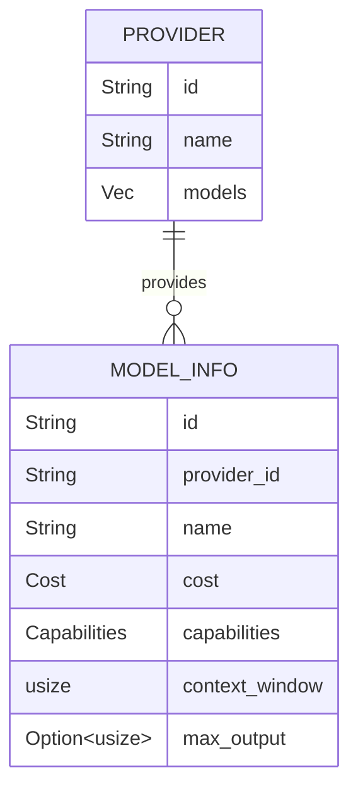

# ModelInfo

**Type:** technology

### From: mod

The `ModelInfo` struct serves as the canonical metadata representation for Large Language Models within the Ragent ecosystem, encoding critical operational parameters that enable intelligent model selection and cost optimization. As a serializable data structure deriving `Debug`, `Clone`, `Serialize`, and `Deserialize` from the serde crate, it bridges runtime decision-making with persistent configuration storage, allowing model catalogs to be cached, transferred, or stored in configuration files.

The struct captures seven essential dimensions of model capability: a unique machine-readable `id` (such as "gpt-4o" or "claude-3-5-sonnet-20241022"), the originating `provider_id` for routing, a human-readable `name` for UI display, structured `cost` information for budget-aware selection, `capabilities` flags for feature detection, `context_window` size for token budgeting, and optional `max_output` limits for response planning. This comprehensive metadata enables sophisticated routing logic where applications might prefer cheaper models for simple tasks, select vision-capable models for image analysis, or enforce context limits to prevent truncation errors.

The design reflects practical operational requirements from production LLM deployments. The `Cost` and `Capabilities` types (imported from `crate::config`) likely encapsulate complex domain logic—per-token pricing that may vary by input/output direction, or capability flags that evolve as providers release new features. Using `usize` for token counts aligns with Rust's pointer-sized integer convention, supporting 64-bit quantities on modern platforms sufficient for million-token context windows. The `Option<usize>` for `max_output` acknowledges provider heterogeneity: OpenAI specifies output limits explicitly, while others may leave this unconstrained or determined dynamically.

## Diagram

## External Resources

- [Serde: Serialization framework for Rust](https://serde.rs/) - Serde: Serialization framework for Rust
- [OpenAI Models Documentation](https://platform.openai.com/docs/models) - OpenAI Models Documentation
- [Anthropic Claude Models](https://docs.anthropic.com/en/docs/about-claude/models) - Anthropic Claude Models

## Sources

- [mod](../sources/mod.md)
