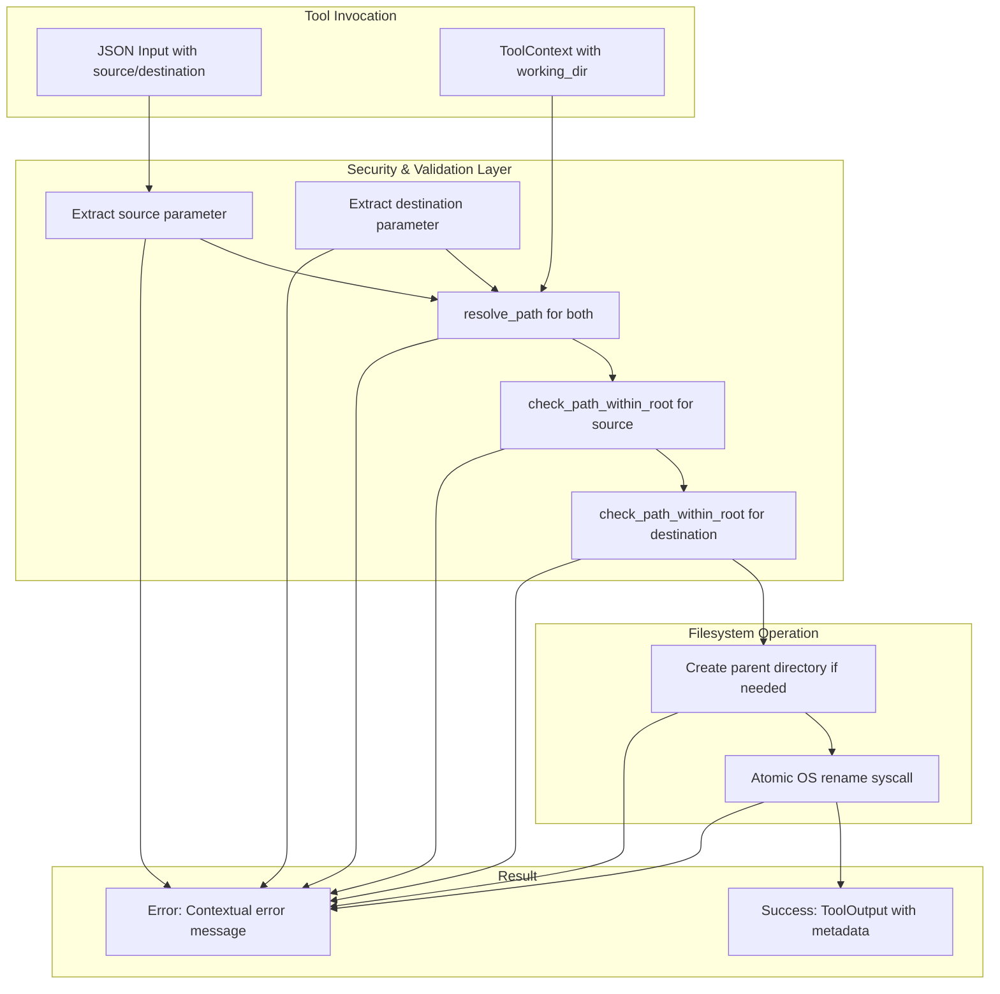

# MoveFileTool

**Type:** product

### From: move_file

MoveFileTool is a production-grade Rust struct that provides secure, atomic file and directory movement capabilities for AI agent systems. The tool serves as a fundamental building block in the ragent-core toolkit, offering a standardized interface for file manipulation operations that can be invoked by autonomous agents through a structured JSON-based API. Its design prioritizes both operational safety and performance, utilizing the operating system's native rename syscall which guarantees atomicity—meaning the operation either completes entirely or has no effect, preventing partial file states that could corrupt data or leave the filesystem in an inconsistent condition.

The implementation reflects modern Rust async programming patterns, integrating with the Tokio runtime to provide non-blocking file I/O operations. This architectural choice is critical for agent systems that must handle multiple concurrent operations without blocking the event loop. The tool incorporates multiple layers of defensive programming: parameter validation through JSON schema, path resolution with working directory context, sandbox enforcement through root path validation, and comprehensive error propagation with contextual messages. These safety mechanisms collectively prevent common vulnerabilities such as directory traversal attacks where malicious input might attempt to access files outside the intended scope.

Historically, file movement tools in automation contexts have been frequent sources of security vulnerabilities and operational failures. MoveFileTool addresses these concerns through its explicit permission categorization system (file:write), which enables administrators to implement principle-of-least-access policies. The tool's metadata-rich return values support audit logging and operational monitoring, recording both the source and destination paths for every operation. This design philosophy aligns with emerging standards in AI agent safety, where tool implementations must be transparent, constrained, and observable to ensure reliable autonomous operation in production environments.

## Diagram

## External Resources

- [Tokio async filesystem rename documentation](https://docs.rs/tokio/latest/tokio/fs/fn.rename.html) - Tokio async filesystem rename documentation
- [Rust standard library fs::rename atomic operation guarantees](https://doc.rust-lang.org/std/fs/fn.rename.html) - Rust standard library fs::rename atomic operation guarantees
- [OWASP path traversal attack prevention guidelines](https://owasp.org/www-community/attacks/Path_Traversal) - OWASP path traversal attack prevention guidelines

## Sources

- [move_file](../sources/move-file.md)
