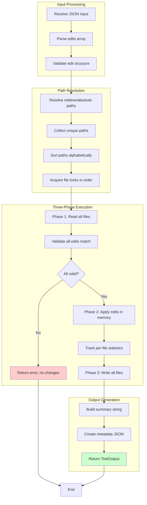

# MultiEditTool

**Type:** technology

### From: multiedit

MultiEditTool is a Rust struct implementing the Tool trait that provides atomic batch editing capabilities across multiple files. It represents a sophisticated approach to file modification that prioritizes safety and consistency over raw performance. The tool operates on a simple but powerful principle: all edits are validated before any files are modified, ensuring that partial failures cannot occur. This makes it particularly suitable for automated code refactoring, AI-assisted coding workflows, and any scenario where file integrity is paramount. The tool accepts a JSON array of edit operations, each specifying a file path, an exact search string, and its replacement text.

The implementation demonstrates several advanced software engineering techniques. It uses asynchronous I/O through Tokio to handle file operations efficiently without blocking threads. It implements deadlock prevention by sorting file paths before acquiring locks, ensuring consistent lock ordering across all operations. The tool provides rich error reporting that distinguishes between search strings not being found and appearing multiple times, helping users craft precise edit specifications. It also tracks detailed statistics about modifications, including per-file breakdowns of edits performed, lines added, and lines removed.

MultiEditTool integrates into a larger tool system through the Tool trait, which standardizes how tools are named, described, parameterized, and executed. The trait implementation includes schema generation for parameter validation, permission categorization for security auditing, and structured output formatting. This design allows the tool to be seamlessly integrated into agent-based systems, command-line interfaces, or web services while maintaining consistent behavior and observability.

## Diagram

## External Resources

- [Rust standard library I/O documentation](https://doc.rust-lang.org/std/io/) - Rust standard library I/O documentation
- [Tokio asynchronous runtime for Rust](https://tokio.rs/) - Tokio asynchronous runtime for Rust
- [serde_json documentation for JSON handling in Rust](https://docs.rs/serde_json/latest/serde_json/) - serde_json documentation for JSON handling in Rust
- [Rust HashMap documentation for key-value storage](https://doc.rust-lang.org/std/collections/struct.HashMap.html) - Rust HashMap documentation for key-value storage

## Sources

- [multiedit](../sources/multiedit.md)
