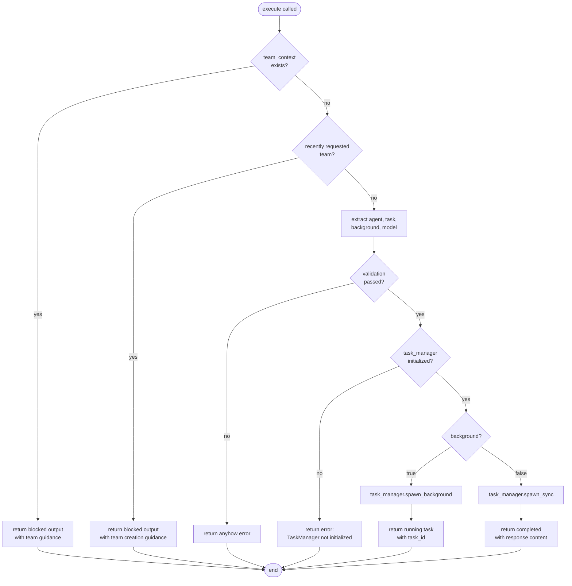

# NewTaskTool

**Type:** technology

### From: new_task

The `NewTaskTool` struct is the central implementation in this file, representing a tool that spawns sub-agents to perform focused tasks within an agent orchestration framework. It implements the `Tool` trait using Rust's `async-trait` procedural macro, enabling asynchronous execution capabilities essential for non-blocking background task spawning. The struct itself is a zero-sized type (unit struct) serving purely as a behavioral container, with all functionality implemented through trait methods rather than instance state.

The tool accepts four parameters through its JSON schema: `agent` (required string naming the agent type like 'explore', 'build', or 'plan'), `task` (required string containing instructions), `background` (optional boolean defaulting to false for concurrent execution), and `model` (optional string for provider/model overrides). A key design feature is the model inheritance logic: when no explicit model is specified, the tool automatically derives the provider and model identifier from the parent session's `active_model`, preventing failures when sub-agents would otherwise use hardcoded defaults incompatible with specialized providers like Copilot.

The `execute` method contains sophisticated workflow routing logic. Before spawning any task, it checks `team_context` to determine if the session is part of an active team collaboration. If so, it blocks execution and returns guidance directing the user toward appropriate team tools (`team_spawn`, `team_task_create`, `team_assign_task` for leads; `team_read_messages`, `team_task_claim` for teammates). Similarly, it invokes `session_recently_requested_team` to detect recent user mentions of team collaboration, blocking with appropriate redirection instructions. This defensive design prevents architectural confusion between individual sub-task delegation and structured team workflows.

## Diagram

## External Resources

- [async-trait crate documentation for async trait implementations in Rust](https://docs.rs/async-trait/latest/async_trait/) - async-trait crate documentation for async trait implementations in Rust
- [Serde serialization framework documentation](https://serde.rs/) - Serde serialization framework documentation

## Sources

- [new_task](../sources/new-task.md)
